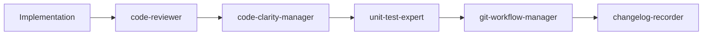

# Enhanced Agent System Architecture

## Overview

The Claude Code agent system now features **21 specialized agents** with **comprehensive overlap resolution**, mandatory delegation enforcement, intelligent multi-agent coordination, and direct workflow management. The system eliminates agent overlap confusion through clear domain boundaries while enabling sophisticated multi-agent collaboration for complex cross-domain tasks.

## 🚨 Delegation Enforcement System

### Main LLM Restrictions
The main LLM is **EXPLICITLY PROHIBITED** from:
- ❌ Writing, editing, or modifying any code
- ❌ Using Write, Edit, MultiEdit tools
- ❌ Performing any technical implementation work
- ❌ Bypassing agent delegation

**Role Restriction**: Main LLM handles coordination, communication, and delegation ONLY.

### Automatic Delegation Triggers
These patterns **FORCE** delegation with no exceptions:
- **Action verbs**: implement, create, build, fix, deploy, test, add, update, refactor, improve, design, setup, configure, analyze, optimize, migrate, integrate, write, edit, modify, develop, code
- **File operations**: ANY mention of Write, Edit, MultiEdit
- **Programming keywords**: function, class, method, variable, API, database
- **Technical implementation**: ANY technical work beyond coordination

## Complete Agent Inventory (21 Agents)

### 🏗️ Core Development Agents
- **frontend-developer**: UI/UX implementation, React/Vue/Angular, browser compatibility
- **backend-architect**: Database design, API architecture, microservices patterns
- **programmer**: Core programming tasks with language hierarchy (Go > TypeScript > Bash > Ruby)
- **qa-specialist**: End-to-end testing, integration testing, performance validation
- **business-analyst**: Requirements analysis, user stories, stakeholder communication
- **content-writer**: Technical documentation, marketing content, API documentation

### 🔬 Specialist Programming Agents
- **ml-engineer**: Python/TensorFlow, data pipelines, MLOps practices
- **blockchain-developer**: Solidity smart contracts, Web3 integration, DeFi protocols
- **mobile-developer**: React Native, iOS, Android development
- **legacy-maintainer**: Java, C#, enterprise systems maintenance and modernization

### 🛡️ Security & Quality Agents
- **security-auditor**: Enhanced with penetration testing, compliance validation (SOC2, GDPR, PCI DSS), threat modeling (STRIDE, PASTA)
- **code-reviewer**: Security analysis, code quality, vulnerability detection
- **code-clarity-manager**: Orchestrates maintainability analysis
- **top-down-analyzer**: Architectural clarity analysis (invoked by code-clarity-manager)
- **bottom-up-analyzer**: Implementation-level clarity analysis (invoked by code-clarity-manager)
- **unit-test-expert**: Comprehensive unit test creation and coverage

### ⚙️ Infrastructure & Operations Agents
- **infrastructure-specialist**: CDK constructs, cloud architecture, deployment strategies
- **systems-architect**: System design, infrastructure planning, technical specifications
- **performance-optimizer**: Performance analysis, bottleneck identification, optimization
- **dependency-scanner**: Third-party dependency analysis, vulnerability scanning
- **debug-specialist**: Critical error resolution (highest priority, blocks all other agents)

### 📋 Workflow & Management Agents
- **git-workflow-manager**: Git operations, branch management, PR creation
- **changelog-recorder**: Automatic changelog generation
- **project-manager**: Multi-step project coordination
- **data-scientist**: Data analysis, insights, statistical processing

### 🔧 Configuration Agents
- **statusline-setup**: Claude Code status line configuration
- **output-style-setup**: Claude Code output style customization

### 🤖 Meta Agents
- **agent-creator**: Design and implement new specialized agents, update main LLM coordination patterns

## Overlap Resolution & Multi-Agent Coordination

### Agent Responsibility Matrix
Each agent has clearly defined primary responsibilities and explicit exclusions:
```yaml
overlap_resolution:
  primary_domains: Single agent handles specific domain expertise
  exclusion_rules: Clear "does NOT handle" boundaries prevent confusion
  multi_agent_triggers: Compound patterns invoke multiple agents with coordination
  conflict_resolution: Domain priority rules (security > performance > convenience)
```

### Multi-Agent Coordination Patterns
```yaml
coordination_types:
  sequential_quality_gates: code-reviewer → code-clarity-manager → unit-test-expert
  parallel_analysis: security-auditor + performance-optimizer + dependency-scanner
  collaborative_architecture: systems-architect → backend-architect + infrastructure-specialist
  domain_collaboration: Multiple specialists with main LLM reconciliation
```

### Main LLM Direct Coordination
The main LLM handles sophisticated multi-agent workflow coordination:
```yaml
direct_coordination:
  trigger_analysis: Detect single vs multi-agent scenarios
  compound_detection: "fix performance tests" → debug + performance + testing
  workflow_management: Sequential and parallel agent coordination
  result_synthesis: Combine multiple agent outputs coherently
  conflict_resolution: Apply domain priority rules for recommendations
```

### Enhanced Specialist Routing
```yaml
specialist_routing:
  project_context_analysis: Technology stack detection for optimal agent selection
  parallel_execution: Multiple specialists working on independent components
  dependency_management: Proper sequencing of dependent tasks
  quality_gate_enforcement: Automatic code-reviewer → code-clarity-manager → testing
```

### Direct Workflow Management
- **Direct Coordination**: Main LLM coordinates directly with specialists
- **Trigger-Based Routing**: Action verbs automatically invoke appropriate agents
- **Quality Gate Enforcement**: Mandatory sequential validation before commits
- **Parallel Coordination**: Multiple Task() calls in single message for efficiency

## Intelligent Routing System

### Trigger-Based Routing
Automatic agent selection based on request patterns:
```yaml
routing_triggers:
  programming: implement, create, build, fix → programmer (or specialist)
  infrastructure: deploy, configure, cloud → infrastructure-specialist
  security: audit, vulnerability, compliance → security-auditor
  testing: test, qa, performance → qa-specialist
  analysis: requirements, business, user story → business-analyst
  content: documentation, marketing → content-writer
```

### Specialist Agent Selection
Project context determines specialist routing:
```yaml
project_specialists:
  ml_projects: Python, TensorFlow, data → ml-engineer
  blockchain_projects: Solidity, Web3, DeFi → blockchain-developer
  mobile_projects: React Native, iOS, Android → mobile-developer
  legacy_systems: Java, C#, enterprise → legacy-maintainer
```

## Workflow Dependencies & Quality Gates

### Sequential Quality Gates


### Parallel Execution Opportunities
```yaml
parallel_scenarios:
  planning_phase: systems-architect + security-auditor + business-analyst
  analysis_phase: performance-optimizer + dependency-scanner
  documentation_phase: content-writer + technical-documentation-writer
  security_phase: security-auditor + code-reviewer (independent components)
```

### Blocking Conditions
```yaml
priority_levels:
  highest: debug-specialist (blocks ALL other agents)
  high: code-reviewer (blocks progression until quality gates pass)
  medium: code-clarity-manager, unit-test-expert
  standard: All other agents based on dependencies
```

## Usage Examples

### Simple Delegation
```bash
User: "Fix the authentication bug in login.ts"
System: Automatically routes to programmer agent
Result: Bug fixed, reviewed, tested, committed
```

### Specialist Routing
```bash
User: "Optimize the ML model training pipeline"
System: Detects ML context, routes to ml-engineer specialist
Result: Specialized ML optimization with domain expertise
```

### Complex Multi-Agent Coordination
```bash
User: "Build secure payment processing with mobile support"
System: Coordinates multiple specialists:
1. systems-architect → security-focused design
2. backend-architect → payment API design
3. mobile-developer → mobile payment UI
4. security-auditor → security validation
5. qa-specialist → comprehensive testing
```

## Enforcement Mechanisms

### 1. Main LLM Restrictions
Explicit prohibitions prevent direct technical work:
```yaml
prohibited_actions:
  - direct_programming: Cannot write/edit code
  - file_modifications: Cannot use Write/Edit/MultiEdit
  - technical_execution: Cannot perform implementation work
```

### 2. Agent Enforcement Reminders
Key agents include bypass detection:
```markdown
🚨 ENFORCEMENT REMINDER 🚨
IF MAIN LLM ATTEMPTS PROGRAMMING: This is a delegation bypass violation!
```

### 3. Mandatory Triggers
Non-negotiable delegation for specific patterns:
```yaml
mandatory_triggers:
  action_verbs: [implement, create, build, fix, etc.]
  file_operations: [Write, Edit, MultiEdit mentions]
  programming_keywords: [function, class, method, etc.]
```

## Overlap Resolution Achievements

### Eliminated Overlaps
1. **Testing Domain**: Clear separation between qa-specialist (execution), unit-test-expert (creation), performance-optimizer (analysis)
2. **Security Analysis**: Coordinated security-auditor (auditing) + code-reviewer (quality gates) + dependency-scanner (supply chain)
3. **Architecture Design**: Layered systems-architect (design) + backend-architect (implementation) + infrastructure-specialist (deployment)
4. **Programming Implementation**: Context-aware routing between programmer and domain specialists
5. **Documentation**: Separated technical-documentation-writer (technical) vs content-writer (user-facing)
6. **Analysis Work**: Clear domains for data-scientist (data), performance-optimizer (performance), business-analyst (requirements)

### Multi-Agent Coordination Examples
```yaml
"fix security vulnerability":
  agents: [security-auditor, code-reviewer, dependency-scanner]
  coordination: Parallel analysis → Main LLM synthesis → Implementation

"optimize slow database queries":
  agents: [performance-optimizer, backend-architect, infrastructure-specialist]
  coordination: Sequential analysis → Coordinated implementation

"debug failing tests":
  agents: [debug-specialist, qa-specialist, unit-test-expert]
  coordination: Debug priority → Testing expertise → Resolution
```

## Key Benefits

1. **Overlap Elimination**: Clear domain boundaries prevent agent confusion
2. **Multi-Agent Coordination**: Sophisticated collaboration for cross-domain tasks
3. **Intelligent Trigger Detection**: Compound patterns invoke appropriate specialists
4. **Conflict Resolution**: Domain priority rules ensure coherent recommendations
5. **Comprehensive Coverage**: 21 specialized agents with coordinated workflows
6. **Mandatory Delegation**: Prevents main LLM from performing technical work
7. **Quality Assurance**: Mandatory quality gates with multi-agent validation

## System Statistics

- **Total Agents**: 21 specialized agents with direct coordination
- **Overlap Resolution**: 8 major overlap categories eliminated
- **Multi-Agent Patterns**: 4 coordination workflow types implemented
- **Trigger Detection**: Compound pattern recognition for multi-agent scenarios
- **Conflict Resolution**: 6 priority rules for agent recommendation conflicts
- **Enforcement Layers**: 5 different bypass prevention mechanisms
- **Routing Rules**: Context-aware routing with file-path and project detection
- **Quality Gates**: 3 mandatory sequential quality checkpoints with multi-agent validation
- **Coordination**: Direct main LLM coordination with sophisticated overlap resolution

This enhanced agent system represents a significant evolution in AI-assisted development, eliminating agent overlap confusion while enabling sophisticated multi-agent collaboration. The system provides comprehensive expertise through intelligent coordination, maintains strict quality standards, and prevents inappropriate main LLM behavior while ensuring both agents are invoked when overlaps require multiple perspectives.