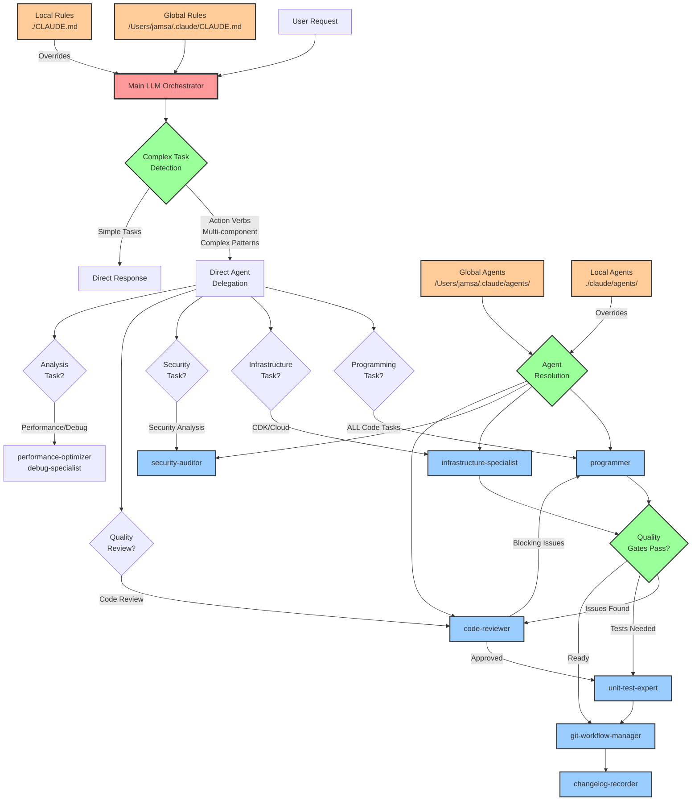

# Agent Architecture Documentation

## System Overview

The agent system operates with the **Main LLM as the primary orchestrator**, directly delegating specialized tasks to appropriate agents. This eliminates re-entrant orchestration patterns and creates a clear delegation hierarchy.

## Architecture Diagram



## Orchestration Flow

### 1. Task Detection Phase
```
User Request → Main LLM → Complex Task Detection
```

**Detection Triggers:**
- **Action Verbs**: implement, create, build, fix, deploy, test, add, update, refactor, improve, design, setup, configure, analyze, optimize, migrate, integrate
- **Multi-component Work**: numbered lists, bullet points, "and" conjunctions
- **Complex Patterns**: phase, component, architecture, infrastructure, monitoring, security

### 2. Direct Agent Delegation
```
Main LLM → Task Analysis → Direct Agent Invocation
```

**Delegation Rules:**
- **Programming Work** → `programmer` agent (ALL coding tasks)
- **Infrastructure Work** → `infrastructure-specialist` agent (CDK, deployment, cloud)
- **Security Work** → `security-auditor` agent (vulnerability analysis)
- **Quality Gates** → `code-reviewer` agent (code review, testing validation)

### 3. Parallel Execution
```
Main LLM → Multiple Task() calls → Parallel Agent Execution
```

**Execution Pattern:**
```typescript
// Single message with multiple agent tasks
Task(subagent_type="programmer", prompt="Implement user authentication")
Task(subagent_type="security-auditor", prompt="Review auth security")
Task(subagent_type="infrastructure-specialist", prompt="Setup auth infrastructure")
```

### 4. Workflow Coordination
```
Agent Results → Main LLM → Dependency Resolution → Next Actions
```

**Quality Gate Workflow:**
1. **Code Implementation** (programmer)
2. **Code Review** (code-reviewer) - *BLOCKS if issues found*
3. **Test Coverage** (unit-test-expert)
4. **Git Operations** (git-workflow-manager) - *Only after quality gates pass*
5. **Documentation** (changelog-recorder)

## Rule Inheritance System

### Global Configuration
```
/Users/jamsa/.claude/
├── CLAUDE.md                    # Global rules and orchestration logic
└── agents/
    ├── programmer.md            # Global programming agent
    ├── infrastructure-specialist.md
    ├── security-auditor.md
    └── code-reviewer.md
```

### Local Project Overrides
```
project/
├── .claude/
│   ├── agents/
│   │   ├── programmer.md        # Override: Python > TypeScript > Go
│   │   └── custom-validator.md  # Project-specific agent
│   └── CLAUDE.md                # Project-specific rules
└── src/
```

### Resolution Order
```mermaid
graph LR
    Request[Agent Request] --> LocalCheck{Local Agent<br/>Exists?}
    LocalCheck -->|Yes| LocalAgent[./claude/agents/agent.md]
    LocalCheck -->|No| GlobalAgent[/Users/jamsa/.claude/agents/agent.md]

    LocalAgent --> Execute[Execute Agent]
    GlobalAgent --> Execute

    GlobalRules[Global CLAUDE.md] --> RuleCheck{Local Rules<br/>Override?}
    LocalClaudeRules[Local ./CLAUDE.md] -->|Yes| RuleCheck
    RuleCheck --> FinalRules[Final Rule Set]

    FinalRules --> Execute
```

## Agent Specializations

### Programmer Agent
**Domain**: ALL programming tasks
- Language hierarchy: Go > TypeScript > Bash > Ruby
- Functional programming enforcement
- NO CLASSES rule (except CDK constructs)
- Dependency minimalism
- Distributed architecture patterns

### Infrastructure-Specialist Agent
**Domain**: CDK and cloud infrastructure
- AWS CDK constructs exclusively
- Functional CDK patterns
- Cloud architecture design
- Deployment strategies
- Infrastructure monitoring

### Security-Auditor Agent
**Domain**: Security analysis and compliance
- Vulnerability detection
- Security pattern enforcement
- Compliance validation
- Threat analysis

### Code-Reviewer Agent
**Domain**: Quality gates and validation
- Code quality review
- Security vulnerability scan
- Test coverage validation
- Build/compilation verification
- BLOCKS workflow until issues resolved

## Workflow Dependencies

### Sequential Dependencies
```
Programming → Code Review → Testing → Git Operations → Documentation
```

### Parallel Opportunities
```
Architecture Planning: systems-architect + security-auditor (parallel)
Implementation: programmer + infrastructure-specialist (parallel when independent)
Analysis: performance-optimizer + debug-specialist (parallel)
```

### Blocking Conditions
```
debug-specialist: HIGHEST PRIORITY - blocks all other agents
code-reviewer: Blocks git operations until quality gates pass
unit-test-expert: Blocks commits until coverage requirements met
```

## Configuration Examples

### Global Language Preference
```markdown
# /Users/jamsa/.claude/CLAUDE.md
<AgentDelegationRules>
<Rule id="programming-delegation">
**PROGRAMMING DELEGATION**: ALL coding tasks → `programmer` agent
Language hierarchy: Go > TypeScript > Bash > Ruby
</Rule>
</AgentDelegationRules>
```

### Local Project Override
```markdown
# ./CLAUDE.md
<TechnologyConstraints>
<Rule id="language-hierarchy">
**PROJECT LANGUAGE HIERARCHY**: Python > TypeScript > Go
FRAMEWORK: FastAPI + React stack
</Rule>
</TechnologyConstraints>
```

### Local Agent Override
```markdown
# ./claude/agents/programmer.md
---
name: programmer
description: Python-focused programmer for this FastAPI project
---

## Technology Constraints
### Language Hierarchy (Project Override)
1. Python (FastAPI backend)
2. TypeScript (React frontend)
3. Bash (deployment scripts)
```

This architecture ensures clean separation of concerns, eliminates re-entrant orchestration, and provides flexible rule inheritance while maintaining the main LLM as the central coordinator.