# Supercharging Claude Code with Specialized Subagents: A Developer's Guide to Orchestrated AI

## The Problem: When One AI Isn't Enough

As developers, we've all experienced the frustration of context-switching between different specialized tasks. One moment you're deep in functional programming patterns, the next you're configuring AWS CDK constructs, then suddenly you're debugging a performance bottleneck. Each task requires a different mindset, different expertise, and different best practices.

What if your AI assistant could mirror this specialized expertise? What if instead of one generalist AI trying to handle everything, you had a team of specialized agents, each an expert in their domain, working together seamlessly?

That's exactly what the Claude Code subagent system provides.

## Enter the Orchestrator: How Subagents Transform Your Workflow

The subagent architecture introduces a powerful concept: **the Main LLM as an orchestrator**. Instead of trying to be an expert at everything, the main AI becomes a project manager, intelligently delegating tasks to specialized agents who excel in specific domains.

Here's how it works:

```mermaid
graph TD
    User[Your Request] --> MainLLM[Claude Orchestrator]
    MainLLM --> Programmer[👨‍💻 Programmer Agent]
    MainLLM --> Infrastructure[🏗️ Infrastructure Specialist]
    MainLLM --> Security[🔒 Security Auditor]
    MainLLM --> Reviewer[✅ Code Reviewer]
```



When you say "implement a REST API with authentication," the orchestrator immediately recognizes this as a complex task and delegates:
- **Programmer Agent**: Implements the API endpoints using your preferred language hierarchy
- **Security Auditor**: Reviews authentication patterns for vulnerabilities
- **Code Reviewer**: Ensures code quality and best practices
- **Infrastructure Specialist**: Sets up CDK constructs for deployment

## Why This Matters: Real Benefits for Real Developers

### 1. **Specialized Expertise at Scale**
Each agent is fine-tuned with domain-specific knowledge. The `programmer` agent enforces functional programming patterns and knows to avoid classes (except for CDK). The `security-auditor` catches vulnerabilities that a generalist might miss. The `infrastructure-specialist` thinks in cloud-native patterns.

### 2. **Parallel Execution for Speed**
Multiple agents can work simultaneously on independent tasks. While the `programmer` implements your feature, the `infrastructure-specialist` can be setting up your deployment pipeline in parallel.

### 3. **Quality Gates That Actually Work**
The `code-reviewer` agent acts as a blocking gate - no code gets committed until it passes review. The `debug-specialist` has the highest priority and blocks all other work when critical issues are detected.

### 4. **Customizable Per Project**
Different projects have different needs. A Python FastAPI project has different requirements than a Go microservice. The inheritance system lets you override global rules locally:

```
Global Config: Go > TypeScript > Bash > Ruby
Local Override: Python > TypeScript > Go
Result: Your project uses Python first
```

## Installation: Getting Your Agent Team Up and Running

### Step 1: Set Up the Global Agent Directory

Create your global Claude configuration directory:

```bash
mkdir -p ~/.claude/agents
cd ~/.claude
```

### Step 2: Install the Core Configuration

Create the main orchestration rules in `~/.claude/CLAUDE.md`:

```markdown
# 🚨 CRITICAL: DIRECT ORCHESTRATION WORKFLOW 🚨

**STEP 1: DETECT COMPLEX TASKS**
Trigger direct agent orchestration for:
- **Action verbs**: implement, create, build, fix, deploy, test
- **Multi-component work**: numbered lists, bullet points
- **Complex patterns**: architecture, infrastructure, monitoring

**STEP 2: DIRECT AGENT DELEGATION**
Main LLM acts as orchestrator and directly invokes appropriate agents:

**Programming Work**: ALL coding tasks → `programmer` agent
**Infrastructure Work**: CDK, deployment → `infrastructure-specialist` agent
**Security Work**: Security analysis → `security-auditor` agent
**Quality Gates**: Code review → `code-reviewer` agent
```

### Step 3: Install Specialized Agents

Download and place agent definitions in `~/.claude/agents/`:

```bash
# Core agents you'll want to install:
~/.claude/agents/programmer.md           # Handles all coding tasks
~/.claude/agents/infrastructure_specialist.md  # AWS CDK and cloud
~/.claude/agents/security_auditor.md     # Security analysis
~/.claude/agents/code_reviewer.md        # Quality gates
~/.claude/agents/unit_test_expert.md     # Test coverage
~/.claude/agents/debug_specialist.md     # Debugging (highest priority)
~/.claude/agents/git_workflow.md         # Git operations
```

Each agent file defines its specialization. For example, `programmer.md`:

```markdown
---
name: programmer
description: Programming specialist for ALL coding tasks
---

## Technology Constraints
### Language Hierarchy
1. Go (distributed systems, performance-critical)
2. TypeScript (type safety, modern syntax)
3. Bash (system operations, automation)
4. Ruby (scripting, Rails applications)

### Functional Programming Rules
- NO CLASSES (exception: CDK constructs only)
- Use pure functions and immutable data
- Composition over inheritance
```

### Step 4: Project-Specific Overrides (Optional)

For project-specific needs, create local overrides:

```bash
# In your project directory:
mkdir -p .claude/agents

# Override the programmer agent for a Python project:
cat > .claude/agents/programmer.md << 'EOF'
---
name: programmer
description: Python-focused programmer for FastAPI
---

## Technology Constraints
### Language Hierarchy (Project Override)
1. Python (FastAPI backend)
2. TypeScript (React frontend)
3. Bash (deployment)
EOF
```

## Usage: Putting Your Agent Team to Work

### Basic Usage: Let the Orchestrator Handle It

Simply describe what you need, and the orchestrator will automatically detect complexity and delegate:

```
"Implement user authentication with JWT tokens and role-based access control"
```

The orchestrator will:
1. Detect this as a complex, multi-component task
2. Invoke the `programmer` agent for implementation
3. Trigger `security-auditor` for vulnerability review
4. Run `code-reviewer` for quality gates
5. Execute `unit-test-expert` for test coverage

### Advanced Usage: Parallel Execution

When you need maximum efficiency, request parallel execution:

```
"Run these agents in parallel: analyze the codebase architecture,
scan for security vulnerabilities, and check dependency versions"
```

This triggers:
- `systems-architect` (architecture analysis)
- `security-auditor` (vulnerability scanning)
- `dependency-scanner` (dependency audit)

All three run simultaneously, dramatically reducing wait time.

### Quality-First Workflow

The system enforces quality through blocking gates:

```
Code Implementation → Code Review → Unit Tests → Git Commit → Changelog
         ↓                ↓            ↓           ↓          ↓
    [programmer]    [code-reviewer] [unit-test] [git-workflow] [changelog]
                         BLOCKS      BLOCKS       BLOCKED      AUTO
```

If the code reviewer finds issues, it blocks the workflow and sends it back to the programmer. No commits happen until quality gates pass.

## Real-World Example: Building a Microservice

Let's say you request: "Create a Go microservice with health checks, metrics, and Kubernetes deployment"

Here's what happens behind the scenes:

1. **Orchestrator Detection**: Recognizes "create," "microservice," and multiple components
2. **Parallel Delegation**:
   - `programmer`: Implements Go service with health endpoints
   - `infrastructure-specialist`: Creates K8s manifests and CDK setup
   - `systems-architect`: Designs service architecture

3. **Sequential Quality Gates**:
   - `code-reviewer`: Reviews Go code for best practices
   - `security-auditor`: Scans for vulnerabilities
   - `unit-test-expert`: Ensures test coverage

4. **Completion**:
   - `git-workflow`: Creates feature branch and commits
   - `changelog`: Documents changes

Total time: Significantly reduced through parallel execution and specialized expertise.

## Advanced Features: The Power of Inheritance

### Global Defaults
Set organization-wide standards in `~/.claude/CLAUDE.md`:
- Language preferences
- Security requirements
- Code style rules
- Git workflow standards

### Project Overrides
Override for specific projects in `./CLAUDE.md`:
- Different language hierarchy
- Project-specific frameworks
- Custom quality gates
- Local compliance rules

### Agent Customization
Create custom agents for your needs:
- Domain-specific validators
- Company-specific deployment agents
- Custom testing frameworks
- Proprietary tool integrations

## Performance Benefits: Why This Architecture Wins

1. **Reduced Context Overhead**: Each agent maintains focused context on its specialty
2. **Parallel Processing**: Multiple agents work simultaneously on independent tasks
3. **Fewer Iterations**: Specialized agents get it right the first time more often
4. **Clear Accountability**: Each agent owns its domain completely
5. **Scalable Complexity**: Add more agents as your needs grow

## Conclusion: Your New Development Superpower

The subagent system transforms Claude Code from a single AI assistant into an entire development team. Each agent brings specialized expertise, working in concert under intelligent orchestration.

Whether you're building microservices, deploying infrastructure, or hunting bugs, you now have a specialized expert for each task. The system adapts to your project needs through inheritance, enforces quality through blocking gates, and accelerates delivery through parallel execution.

Stop context-switching. Start orchestrating. Let specialized agents handle what they do best while you focus on what matters: shipping great software.

---

*Ready to supercharge your development workflow? Install the subagent system today and experience the power of orchestrated AI development. Your code quality will thank you.*