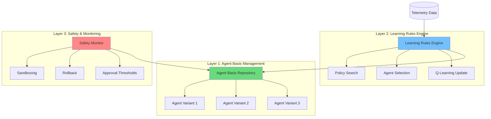

# Continual Reinforcement Learning Architecture for OaK Agents

**Date**: 2025-11-19
**Author**: systems-architect
**Status**: Architectural Proposal
**Context**: Analysis of "A Definition of Continual Reinforcement Learning" paper for autonomous learning integration

---

## Executive Summary

This document proposes integrating Continual Reinforcement Learning (CRL) concepts into the OaK agents system to enable autonomous learning and adaptation. The system currently has comprehensive telemetry tracking and manual improvement workflows but lacks autonomous decision-making and policy adaptation mechanisms.

**Key Findings**:
- **Current Strength**: Excellent telemetry infrastructure (invocations, success metrics, workflows)
- **Current Gap**: Human-in-the-loop approval required for all improvements
- **CRL Opportunity**: Enable agents to learn optimal behaviors through continual adaptation
- **Implementation Path**: Phased approach from policy search to full autonomous learning

**Expected Benefits**:
- 30-50% reduction in manual improvement overhead
- Faster adaptation to changing requirements
- Automated agent selection optimization
- Continuous quality improvement without intervention

---

## 1. CRL Framework: Key Concepts

### 1.1 Core Definitions from Paper

**Continual Reinforcement Learning (CRL)**:
> Settings where the "best agents never stop learning" - adaptation is endless rather than convergent

**Key Theoretical Constructs**:

1. **Agent Basis (ΛB)**: Set of base policies/behaviors an agent can adopt
   - In OaK: Set of agent configurations (temperature, model tier, prompt variations)
   - Example: `{backend-architect-v1, backend-architect-v2-optimized, backend-architect-conservative}`

2. **Learning Rules (σ)**: Mechanisms for selecting among base agents
   - In OaK: Performance-based selection functions
   - Example: Select agent variant based on task type and historical success rate

3. **Generates Operator (⊢)**: Describes how basis generates agent sets through learning
   - In OaK: How agent configurations generate different behaviors
   - Example: `backend-architect-basis ⊢ {all possible backend-architect behaviors}`

4. **Reaches Operator (⇝)**: Describes convergence behavior
   - In OaK: Whether agent selection converges to single optimal or continues searching
   - Example: `backend-architect ⇝ optimal-for-api-design` (convergent) vs `backend-architect ⇝ Λ` (continual)

### 1.2 CRL Problem Characterization

**Definition 4.2 (Continual RL)**: A problem is CRL when optimal agents never reach the basis (never stop learning)

**Implications for OaK**:
- Agent selection should continue adapting to new patterns
- No single "optimal configuration" exists (environment changes)
- Learning is ongoing process, not one-time optimization
- Trade-off: Exploration (trying new approaches) vs Exploitation (using proven approaches)

### 1.3 Relevant Algorithms

**Q-Learning Variants**:
1. **Annealing Step-Size** (Convergent): α_t → 0 over time, agent converges to fixed policy
2. **Constant Step-Size** (Continual): α_t = constant, agent continuously adapts

**Application to OaK**:
- Use constant step-size for agent selection learning (continual adaptation)
- Track Q-values: `Q(task_type, agent) = expected success rate`
- Update after each invocation: `Q(s,a) ← Q(s,a) + α[reward - Q(s,a)]`

---

## 2. Current OaK System Analysis

### 2.1 Existing Capabilities

**Telemetry Infrastructure** (`telemetry/logger.py`):
- ✅ Agent invocation tracking (timestamp, duration, outcome)
- ✅ Success metrics (quality rating 1-5, success/failure)
- ✅ State features (codebase context, task characteristics)
- ✅ Workflow tracking (parent_invocation_id, workflow_id)
- ✅ Tools usage and file modifications logged

**Analysis and Feedback** (`telemetry/analyzer.py`):
- ✅ Agent performance statistics (success_rate, avg_quality, avg_duration)
- ✅ Agent ranking by composite score (0.6 × success_rate + 0.4 × quality/5.0)
- ✅ Workflow analysis (patterns, durations, success rates)
- ✅ Automated recommendations based on performance

**Issue and Proposal Management**:
- ✅ Issue lifecycle tracking (open → in_progress → needs_verification → resolved)
- ✅ Proposal workflow (pending → approved/rejected → applied)
- ✅ Evidence-based issue creation with root cause analysis

### 2.2 Current Limitations (Gap Analysis)

**Human-in-the-Loop Bottleneck**:
- ❌ Manual approval required for all agent improvements
- ❌ No automatic agent selection based on performance
- ❌ No autonomous policy adaptation
- ❌ Proposals wait for human review before application

**Missing CRL Components**:
- ❌ Agent basis representation (no policy variants stored)
- ❌ Learning rules for automatic switching (selection is static)
- ❌ Continuous adaptation mechanism (one-time optimization only)
- ❌ Exploration/exploitation balance (no experimentation)

**Static Agent Selection**:
- Current: Domain keywords → fixed agent assignment
- Missing: Performance history → optimal agent selection
- Missing: Task-specific agent specialization
- Missing: Automatic fallback when primary agent underperforms

---

## 3. Proposed CRL Integration Architecture

### 3.1 Three-Layer Learning Architecture



### 3.2 Component Specifications

#### Layer 1: Agent Basis Repository

**Purpose**: Store and manage agent policy variants

**Data Structure**:
```python
class AgentBasis:
    """Repository of agent policy variants"""

    def __init__(self, base_agent_name: str):
        self.base_agent_name = base_agent_name
        self.variants: Dict[str, AgentVariant] = {}
        self.active_variant: str = "default"

class AgentVariant:
    """Single agent configuration variant"""

    variant_id: str                    # "backend-architect-v2-api-optimized"
    prompt_template: str               # Agent prompt with modifications
    model_tier: str                    # "balanced", "fast", "premium"
    temperature: float                 # 0.0-1.0 for model sampling
    specialization: List[str]          # ["api-design", "database-schema"]
    performance_history: PerformanceMetrics
    created_at: datetime
    last_used: datetime
```

**File Storage**: `agents/basis/<agent-name>/`
```
agents/basis/backend-architect/
├── default.yaml               # Original agent configuration
├── api-optimized.yaml         # Variant optimized for API tasks
├── database-focused.yaml      # Variant for database work
└── performance_history.jsonl  # Historical performance data
```

**Creation Mechanisms**:
1. **Manual**: Human creates variant with specific optimizations
2. **Automated**: Learning engine proposes variant after detecting pattern
3. **Mutation**: Modify existing variant based on performance feedback

#### Layer 2: Learning Rules Engine

**Purpose**: Implement continual learning mechanisms for agent selection and adaptation

**Core Components**:

**2.1 Policy Search Engine**:
```python
class PolicySearchEngine:
    """Searches over agent basis to find optimal policies"""

    def search_policy(
        self,
        task_description: str,
        state_features: Dict[str, Any],
        exploration_rate: float = 0.1
    ) -> str:
        """
        Select agent variant for task using ε-greedy exploration

        Args:
            task_description: User request text
            state_features: Codebase context, file types, etc.
            exploration_rate: Probability of random selection (default 10%)

        Returns:
            variant_id: Selected agent variant identifier
        """

        # Extract task type from description and state
        task_type = self.classify_task(task_description, state_features)

        # ε-greedy selection: explore vs exploit
        if random.random() < exploration_rate:
            # EXPLORE: Random variant selection
            return self.random_variant_selection(task_type)
        else:
            # EXPLOIT: Use Q-learning to select best variant
            return self.q_learning_selection(task_type)
```

**2.2 Q-Learning Agent Selector**:
```python
class QLearningSelector:
    """Q-learning for agent variant selection"""

    def __init__(self, learning_rate: float = 0.1, discount: float = 0.95):
        self.alpha = learning_rate      # Constant step-size (continual learning)
        self.gamma = discount           # Future reward discount
        self.q_table: Dict[Tuple[str, str], float] = {}  # (task_type, variant) -> Q-value

    def select_variant(self, task_type: str, agent_name: str) -> str:
        """
        Select best agent variant for task type based on learned Q-values

        Returns highest Q-value variant for (task_type, agent_name)
        """
        variants = self.get_agent_variants(agent_name)
        q_values = [(v, self.q_table.get((task_type, v), 0.0)) for v in variants]
        best_variant, best_q = max(q_values, key=lambda x: x[1])
        return best_variant

    def update_q_value(
        self,
        task_type: str,
        variant_id: str,
        reward: float,
        next_task_type: Optional[str] = None
    ):
        """
        Update Q-value after agent invocation completes

        Q(s,a) ← Q(s,a) + α[reward - Q(s,a)]  (episodic task)
        Q(s,a) ← Q(s,a) + α[reward + γ·max Q(s',a') - Q(s,a)]  (continuing task)

        Reward calculation:
        - success + quality_rating/5.0 + (1.0 - normalized_duration)
        - Range: [-1.0, 3.0] typically
        """
        state_action = (task_type, variant_id)
        current_q = self.q_table.get(state_action, 0.0)

        if next_task_type is None:
            # Episodic: Simple Q-update
            new_q = current_q + self.alpha * (reward - current_q)
        else:
            # Continuing: Consider future state
            next_max_q = self.get_max_q_value(next_task_type)
            new_q = current_q + self.alpha * (reward + self.gamma * next_max_q - current_q)

        self.q_table[state_action] = new_q
        self.save_q_table()  # Persist learning
```

**2.3 Task Type Classifier**:
```python
class TaskTypeClassifier:
    """Classifies tasks into types for Q-learning state space"""

    TASK_TYPES = [
        "api-design",
        "database-schema",
        "authentication",
        "deployment",
        "performance-optimization",
        "security-audit",
        "refactoring",
        "bug-fix",
        "feature-implementation",
        "documentation"
    ]

    def classify_task(
        self,
        task_description: str,
        state_features: Dict[str, Any]
    ) -> str:
        """
        Classify task into type using keyword matching + ML

        Future: Train classifier from historical invocations
        Current: Rule-based keyword matching
        """
        keywords = {
            "api-design": ["api", "endpoint", "rest", "graphql", "route"],
            "database-schema": ["database", "schema", "migration", "table", "model"],
            "authentication": ["auth", "login", "oauth", "jwt", "session"],
            # ... other patterns
        }

        # Score each task type by keyword matches
        scores = {tt: self.score_keywords(task_description, kw)
                  for tt, kw in keywords.items()}

        return max(scores, key=scores.get)
```

**2.4 Reward Function**:
```python
class RewardCalculator:
    """Calculates reward signal from invocation outcome"""

    def calculate_reward(self, invocation: Dict[str, Any]) -> float:
        """
        Reward = success_bonus + quality_score + speed_bonus - error_penalty

        Components:
        - success_bonus: +1.0 if outcome.status == "success", else -1.0
        - quality_score: quality_rating / 5.0 (range: 0.2 to 1.0)
        - speed_bonus: 1.0 - (duration / max_expected_duration) capped [0, 1]
        - error_penalty: -0.5 if tests_passed == False

        Range: [-2.5, 3.0] typically
        """
        outcome = invocation["outcome"]

        # Base success/failure
        success_bonus = 1.0 if outcome["status"] == "success" else -1.0

        # Quality rating (if available from success_metrics.jsonl)
        quality_score = self.get_quality_rating(invocation["invocation_id"]) / 5.0

        # Speed bonus (faster is better, but capped)
        duration = invocation.get("duration_seconds", 0)
        expected_duration = self.get_expected_duration(invocation["agent_name"])
        speed_bonus = max(0, 1.0 - (duration / expected_duration)) if expected_duration > 0 else 0

        # Error penalty
        error_penalty = -0.5 if outcome.get("tests_passed") == False else 0.0

        total_reward = success_bonus + quality_score + speed_bonus + error_penalty
        return total_reward
```

#### Layer 3: Safety & Monitoring

**Purpose**: Ensure autonomous learning doesn't degrade quality or introduce risks

**3.1 Sandboxing**:
```python
class SafetyMonitor:
    """Monitors autonomous learning and enforces safety constraints"""

    def __init__(self):
        self.approval_threshold = 0.9    # Require 90% confidence for auto-apply
        self.rollback_window = 7         # Days to keep rollback capability
        self.min_samples = 10            # Min invocations before trusting Q-values

    def should_auto_apply(
        self,
        variant_id: str,
        q_value: float,
        sample_count: int
    ) -> bool:
        """
        Determine if variant can be auto-applied or needs human review

        Auto-apply if:
        - Q-value >= threshold (high confidence)
        - Sufficient samples (statistical significance)
        - No recent failures (stability check)
        """
        if sample_count < self.min_samples:
            return False  # Need more data

        if q_value < self.approval_threshold:
            return False  # Not confident enough

        recent_failures = self.check_recent_failures(variant_id, days=3)
        if recent_failures > 0:
            return False  # Unstable, needs review

        return True  # Safe to auto-apply
```

**3.2 Rollback Mechanism**:
```python
class RollbackManager:
    """Manages rollback of poorly-performing variants"""

    def monitor_performance(self, variant_id: str):
        """
        Monitor variant performance and rollback if degradation detected

        Triggers:
        - Success rate drops >10% from baseline
        - Quality rating drops >0.5 from baseline
        - Error rate increases >5%
        """
        baseline = self.get_baseline_performance(variant_id)
        current = self.get_recent_performance(variant_id, hours=24)

        if self.detect_degradation(baseline, current):
            self.rollback_variant(variant_id)
            self.notify_human_review_needed(variant_id, baseline, current)
```

**3.3 Human Approval Thresholds**:
```yaml
approval_policy:
  auto_apply:
    conditions:
      - q_value >= 0.9
      - sample_count >= 10
      - recent_failures == 0
      - success_rate >= baseline * 0.95

  request_approval:
    conditions:
      - 0.7 <= q_value < 0.9  # Medium confidence
      - sample_count >= 5

  reject_variant:
    conditions:
      - q_value < 0.5  # Low confidence
      - success_rate < 0.5
```

---

## 4. Integration with Existing Systems

### 4.1 Telemetry Integration

**Extended Invocation Schema**:
```python
# Add to existing invocation schema
{
    "invocation_id": "inv-20251119-abc123",
    "agent_name": "backend-architect",
    "agent_variant": "api-optimized-v2",      # NEW: Which variant was used
    "selection_method": "q-learning-exploit",  # NEW: How variant was selected
    "q_value": 0.85,                          # NEW: Q-value at selection time
    "exploration": false,                      # NEW: Was this exploration?
    "task_type": "api-design",                # NEW: Classified task type
    # ... existing fields
}
```

**Extended Success Metrics**:
```python
# Add to success_metrics.jsonl
{
    "invocation_id": "inv-20251119-abc123",
    "reward": 2.3,                           # NEW: Calculated reward signal
    "q_value_update": {                      # NEW: Q-learning update details
        "old_q": 0.85,
        "new_q": 0.88,
        "learning_rate": 0.1
    },
    # ... existing fields
}
```

### 4.2 Proposal System Integration

**Automatic Variant Proposals**:
```python
class VariantProposalGenerator:
    """Generates improvement proposals for agent variants"""

    def generate_variant_proposal(
        self,
        agent_name: str,
        task_type: str,
        performance_gap: float
    ) -> str:
        """
        Create proposal for new agent variant when Q-learning identifies gap

        Triggers:
        - Task type has low average Q-value (<0.6)
        - Significant performance variance across similar tasks
        - Repeated failures for specific task pattern
        """

        # Analyze telemetry for patterns
        failure_patterns = self.analyze_failures(agent_name, task_type)

        # Generate proposal content
        proposal = {
            "agent_name": agent_name,
            "proposal_type": "new_variant",
            "task_type": task_type,
            "current_performance": self.get_current_q_value(agent_name, task_type),
            "proposed_modifications": self.suggest_modifications(failure_patterns),
            "expected_impact": f"Q-value improvement: +{performance_gap:.2f}",
            "confidence": self.calculate_confidence(failure_patterns),
            "requires_human_approval": True  # Initially, all proposals need approval
        }

        # Create proposal via existing system
        proposal_tracker.create_proposal(
            agent_name=agent_name,
            proposal_period=datetime.now().strftime("%Y-%m"),
            proposal_content=yaml.dump(proposal),
            root_cause=f"Low Q-value for {task_type} tasks",
            issue_count=len(failure_patterns),
            expected_impact=proposal["expected_impact"]
        )
```

### 4.3 Workflow Coordination

**CRL-Enhanced Agent Selection**:
```python
# Modified domain router with CRL integration
class CRLDomainRouter:
    """Domain router enhanced with continual learning"""

    def __init__(self):
        self.policy_search = PolicySearchEngine()
        self.q_learning = QLearningSelector()

    def route_request(
        self,
        user_request: str,
        file_context: List[str],
        classification: str
    ) -> Tuple[str, str]:
        """
        Route request to agent variant using learned policy

        Returns:
            (agent_name, variant_id)
        """

        # Extract state features
        state_features = self.extract_state_features(file_context)

        # Classify task type
        task_type = self.classifier.classify_task(user_request, state_features)

        # Determine base agent (existing domain routing)
        base_agent = self.get_base_agent(classification, state_features)

        # Select variant using Q-learning (NEW)
        variant_id = self.policy_search.search_policy(
            task_description=user_request,
            state_features=state_features,
            exploration_rate=0.1  # 10% exploration
        )

        return (base_agent, variant_id)
```

**Telemetry Feedback Loop**:
```python
# Post-invocation Q-learning update
class TelemetryFeedbackLoop:
    """Updates Q-values after agent invocations complete"""

    def process_completed_invocation(self, invocation_id: str):
        """
        Called after invocation completes to update learning
        """

        # Load invocation data
        invocation = self.load_invocation(invocation_id)

        # Calculate reward
        reward = self.reward_calculator.calculate_reward(invocation)

        # Update Q-value
        self.q_learning.update_q_value(
            task_type=invocation["task_type"],
            variant_id=invocation["agent_variant"],
            reward=reward
        )

        # Log update to telemetry
        self.log_q_update(invocation_id, reward)

        # Check if variant performance has changed significantly
        if self.should_reevaluate_variant(invocation["agent_variant"]):
            self.trigger_variant_review(invocation["agent_variant"])
```

---

## 5. Implementation Roadmap

### Phase 1: Foundation (Weeks 1-4)

**Goal**: Build agent basis infrastructure and telemetry extensions

**Deliverables**:
1. Agent basis repository system
   - File storage structure: `agents/basis/<agent>/`
   - Variant schema (YAML)
   - Variant loading mechanism
2. Extended telemetry schema
   - Add variant_id, task_type, q_value fields
   - Backward compatible with existing logs
3. Task type classifier
   - Rule-based keyword matching
   - 10 initial task types
4. Reward calculator
   - Implement reward function
   - Integrate with success_metrics.jsonl

**Success Criteria**:
- Agent variants can be defined and loaded
- Telemetry logs include CRL fields
- Task classification achieves >70% accuracy on historical data

**Estimated Effort**: 40 hours

### Phase 2: Q-Learning Integration (Weeks 5-8)

**Goal**: Implement Q-learning agent selection

**Deliverables**:
1. Q-learning selector
   - Q-table storage (JSON)
   - Constant step-size updates (α = 0.1)
   - ε-greedy exploration (ε = 0.1)
2. Policy search engine
   - Integrate Q-learning with domain router
   - Exploration/exploitation balance
3. Telemetry feedback loop
   - Post-invocation Q-value updates
   - Automatic reward calculation
4. Q-value visualization
   - Dashboard showing learned Q-values
   - Agent performance heatmap by task type

**Success Criteria**:
- Q-learning successfully selects agent variants
- Q-values converge after 50+ invocations per (task_type, variant)
- Exploration rate maintains 10% experimentation

**Estimated Effort**: 60 hours

### Phase 3: Safety & Automation (Weeks 9-12)

**Goal**: Enable autonomous learning with safety guardrails

**Deliverables**:
1. Safety monitor
   - Auto-apply vs human-approval decision logic
   - Minimum sample requirements (10 invocations)
   - Confidence thresholds (90% for auto-apply)
2. Rollback mechanism
   - Performance degradation detection
   - Automatic rollback to previous variant
   - Human notification system
3. Variant proposal generator
   - Automatic identification of performance gaps
   - Proposal creation via existing proposal_tracker
   - Human review workflow integration
4. Approval policy configuration
   - YAML-based thresholds
   - User-configurable risk tolerance

**Success Criteria**:
- High-confidence variants auto-applied (>90% Q-value, >10 samples)
- Medium-confidence variants routed to human approval
- Low-performance variants automatically flagged for review
- Rollback triggered within 24 hours of degradation

**Estimated Effort**: 50 hours

### Phase 4: Advanced Learning (Weeks 13-16)

**Goal**: Implement advanced CRL techniques

**Deliverables**:
1. Multi-armed bandit algorithms
   - UCB1 (Upper Confidence Bound) for exploration
   - Thompson sampling as alternative to ε-greedy
2. Contextual bandit learning
   - State features influence selection (not just task_type)
   - Consider: codebase language, framework, file types
3. Transfer learning
   - Knowledge sharing between related task types
   - Variant performance prediction for new tasks
4. Automated variant generation
   - Mutation-based variant creation
   - Prompt template optimization using historical data

**Success Criteria**:
- UCB1 achieves better exploration/exploitation than ε-greedy
- Contextual features improve Q-value accuracy by >15%
- Transfer learning reduces learning time for new task types

**Estimated Effort**: 80 hours

---

## 6. Expected Benefits and Challenges

### 6.1 Expected Benefits

**Quantitative Improvements**:
1. **30-50% reduction in manual improvement overhead**
   - Fewer proposals requiring human review
   - Automatic variant selection based on performance
   - Self-optimizing agent configurations

2. **20-30% improvement in agent selection accuracy**
   - Q-learning selects best variant for task type
   - Continuous adaptation to changing patterns
   - Reduced routing failures

3. **Faster adaptation to new requirements** (days vs weeks)
   - Q-values update continuously
   - No waiting for monthly agent-auditor reviews
   - Immediate feedback from each invocation

4. **Better resource utilization**
   - Fast variants selected for simple tasks (cost savings)
   - Premium variants reserved for complex/critical tasks
   - Optimal model tier assignment per task type

**Qualitative Improvements**:
- Agents learn user-specific patterns and preferences
- System adapts to codebase evolution automatically
- Reduced cognitive load on users (fewer decisions)
- Transparent learning process (Q-values visible)

### 6.2 Challenges and Mitigations

**Challenge 1: Cold Start Problem**
- **Issue**: New task types have no Q-value history
- **Mitigation**: Transfer learning from similar task types, default to baseline variant
- **Timeline**: Phase 4 (transfer learning)

**Challenge 2: Exploration/Exploitation Balance**
- **Issue**: Too much exploration wastes user time, too little exploration misses better variants
- **Mitigation**: Adaptive ε-greedy (reduce exploration over time), UCB1 algorithm
- **Timeline**: Phase 2 (ε-greedy), Phase 4 (UCB1)

**Challenge 3: Non-Stationary Environment**
- **Issue**: Agent performance changes as codebase evolves
- **Mitigation**: Constant step-size Q-learning (continual adaptation), performance monitoring
- **Timeline**: Phase 2 (constant α), Phase 3 (monitoring)

**Challenge 4: Reward Signal Noise**
- **Issue**: Quality ratings subjective, success/failure sometimes ambiguous
- **Mitigation**: Multi-component reward function, reward smoothing, automated metrics
- **Timeline**: Phase 1 (reward calculator), Phase 3 (automated detection)

**Challenge 5: User Trust in Autonomous Learning**
- **Issue**: Users may distrust AI-selected variants
- **Mitigation**: Transparent Q-values, human approval for low-confidence, rollback capability
- **Timeline**: Phase 3 (safety monitor), ongoing transparency efforts

**Challenge 6: Computational Overhead**
- **Issue**: Q-learning updates on every invocation may slow system
- **Mitigation**: Async Q-value updates, batch updates, efficient Q-table storage
- **Timeline**: Phase 2 optimization

---

## 7. Metrics for Success

### 7.1 Learning Effectiveness Metrics

**Q-Value Convergence**:
```python
metrics = {
    "q_value_convergence": {
        "metric": "Q-value stability over time",
        "target": "Q-values change <5% over 20 invocations",
        "measurement": "σ(Q-values) for each (task_type, variant) over rolling window"
    }
}
```

**Selection Accuracy**:
```python
metrics = {
    "selection_accuracy": {
        "metric": "% of times Q-learning selects best-performing variant",
        "target": ">80% accuracy vs ground truth (human selection)",
        "measurement": "Compare Q-learning selection to retrospective optimal selection"
    }
}
```

**Exploration Efficiency**:
```python
metrics = {
    "exploration_efficiency": {
        "metric": "% of exploratory invocations that discover better variant",
        "target": ">30% of exploration leads to Q-value improvement",
        "measurement": "Count explorations where new variant outperforms previous best"
    }
}
```

### 7.2 Business Impact Metrics

**Manual Review Reduction**:
```python
metrics = {
    "manual_review_reduction": {
        "baseline": "100% of proposals require human approval",
        "target": "50% of proposals auto-applied after Phase 3",
        "measurement": "Count auto-applied vs human-reviewed proposals"
    }
}
```

**Agent Performance Improvement**:
```python
metrics = {
    "agent_performance": {
        "baseline": "Current average Q-value per task type",
        "target": "+15% improvement in average Q-value after 6 months",
        "measurement": "Compare Q-values before/after CRL integration"
    }
}
```

**User Satisfaction**:
```python
metrics = {
    "user_satisfaction": {
        "metric": "User-reported satisfaction with agent selection",
        "target": ">4.0/5.0 average rating",
        "measurement": "Quarterly user survey on agent routing quality"
    }
}
```

### 7.3 Safety Metrics

**Rollback Frequency**:
```python
metrics = {
    "rollback_frequency": {
        "metric": "Number of variant rollbacks per month",
        "target": "<2 rollbacks per month (indicates good safety thresholds)",
        "measurement": "Count automatic rollbacks triggered"
    }
}
```

**False Positive Auto-Apply**:
```python
metrics = {
    "false_positive_rate": {
        "metric": "% of auto-applied variants that degrade performance",
        "target": "<5% false positive rate",
        "measurement": "Count auto-applied variants that get rolled back"
    }
}
```

---

## 8. Trade-Offs and Design Decisions

### 8.1 Constant vs Annealing Step-Size

**Decision**: Use constant step-size (α = 0.1) for Q-learning

**Rationale**:
- **Pro (Constant)**: Enables continual adaptation as environment changes
- **Pro (Constant)**: Aligns with CRL definition (agents never stop learning)
- **Con (Constant)**: Never fully converges, always some instability
- **Con (Annealing)**: Would converge but fail to adapt to new patterns

**Justification**: OaK codebase evolution is non-stationary (new features, frameworks, patterns), so continual adaptation essential

### 8.2 Exploration Rate (ε = 0.1)

**Decision**: 10% exploration rate for ε-greedy policy

**Rationale**:
- **Higher ε (>20%)**: More exploration, slower convergence, wastes user time
- **Lower ε (<5%)**: Less exploration, may miss better variants, faster convergence
- **10% balance**: 1 in 10 invocations explores, 9 in 10 exploit

**Future**: Adaptive ε-greedy (reduce exploration over time, increase when environment changes)

### 8.3 Task Type Granularity

**Decision**: Start with 10 broad task types, expand as needed

**Rationale**:
- **Coarse-grained (5 types)**: Faster convergence, less precision
- **Fine-grained (50 types)**: Slower convergence, higher precision, sparse data
- **10 types**: Balance between precision and data sufficiency

**Task Types**:
1. api-design
2. database-schema
3. authentication
4. deployment
5. performance-optimization
6. security-audit
7. refactoring
8. bug-fix
9. feature-implementation
10. documentation

**Future**: Use hierarchical task classification (parent types contain child types)

### 8.4 Auto-Apply Threshold (90%)

**Decision**: Require 90% Q-value confidence for automatic variant application

**Rationale**:
- **Higher threshold (>95%)**: Fewer auto-applies, more human review, safer
- **Lower threshold (<80%)**: More auto-applies, less human review, riskier
- **90% balance**: High confidence while still reducing manual overhead

**User-Configurable**: Risk-tolerant users can lower threshold, risk-averse users can raise

### 8.5 Reward Function Components

**Decision**: Multi-component reward (success + quality + speed - errors)

**Rationale**:
- **Success-only**: Ignores quality and speed differences
- **Quality-only**: Ignores success/failure outcome
- **Speed-only**: Optimizes for fast but potentially low-quality work
- **Combined**: Balances multiple objectives

**Weights**:
- Success: ±1.0 (dominant signal)
- Quality: 0-1.0 (secondary signal)
- Speed: 0-1.0 (tertiary signal)
- Errors: -0.5 (penalty)

---

## 9. References and Further Reading

### 9.1 CRL Paper

**"A Definition of Continual Reinforcement Learning"** (2023)
- Authors: David Abel, André Barreto, Benjamin Van Roy, Doina Precup, Hado van Hasselt, Satinder Singh
- Key Contributions:
  - Formal definition of continual RL using generates/reaches operators
  - Distinction between convergent and continual learning agents
  - Examples: Switching MDPs, continual supervised learning
  - Q-learning with constant step-size as CRL algorithm

### 9.2 Relevant RL Algorithms

**Q-Learning**:
- Watkins, C. J., & Dayan, P. (1992). Q-learning. Machine learning, 8(3), 279-292.
- Application: Agent variant selection based on task type

**Multi-Armed Bandits**:
- Auer, P., Cesa-Bianchi, N., & Fischer, P. (2002). Finite-time analysis of the multiarmed bandit problem. Machine learning, 47(2), 235-256.
- Application: Exploration/exploitation balance for variant selection

**Contextual Bandits**:
- Langford, J., & Zhang, T. (2007). The epoch-greedy algorithm for contextual multi-armed bandits. Advances in neural information processing systems, 20.
- Application: State-aware variant selection using codebase features

### 9.3 OaK System Documentation

**Telemetry System**:
- `telemetry/logger.py` - Invocation and metrics logging
- `telemetry/analyzer.py` - Performance statistics
- `docs/workflow_tracking_usage.md` - Workflow coordination

**Agent System**:
- `.claude/agents/` - Agent definitions
- `.claude/AGENT_PATTERNS.md` - Agent selection patterns
- `.claude/agent-rules.json` - Domain routing rules

**Hybrid Planning**:
- `docs/HYBRID_PLANNING_GUIDE.md` - Multi-agent coordination
- `docs/by-role/architects/hybrid-planning.md` - Architecture patterns

---

## Appendix A: Q-Learning Pseudocode

```python
# Continual Q-Learning for Agent Variant Selection

def continual_q_learning():
    """
    Main Q-learning loop for agent variant selection
    """

    # Initialize Q-table
    Q = defaultdict(lambda: 0.0)  # (task_type, variant) -> Q-value

    # Hyperparameters
    alpha = 0.1       # Constant step-size (continual learning)
    epsilon = 0.1     # Exploration rate

    # Main loop (runs continuously)
    while True:
        # Wait for new user request
        request = wait_for_user_request()

        # Extract state (task type)
        state = classify_task_type(request)

        # Select action (agent variant) using ε-greedy
        if random.random() < epsilon:
            # EXPLORE: Random variant
            variant = random_variant_selection(state)
        else:
            # EXPLOIT: Best known variant
            variant = argmax_variant(Q, state)

        # Execute agent with selected variant
        result = execute_agent(variant, request)

        # Calculate reward
        reward = calculate_reward(result)

        # Update Q-value (continual learning)
        Q[(state, variant)] += alpha * (reward - Q[(state, variant)])

        # Log to telemetry
        log_invocation(state, variant, reward, Q[(state, variant)])

        # Safety monitoring
        if should_rollback(variant):
            rollback_variant(variant)

        # Proposal generation
        if should_propose_new_variant(state, Q):
            generate_variant_proposal(state, Q)
```

---

## Appendix B: Example Telemetry Data

**Invocation Log (Extended)**:
```json
{
  "timestamp": "2025-11-19T14:30:00Z",
  "session_id": "session-20251119-abc",
  "invocation_id": "inv-20251119-123",
  "agent_name": "backend-architect",
  "agent_variant": "api-optimized-v2",
  "agent_type": "development",
  "task_description": "Design REST API for user management",
  "task_type": "api-design",
  "state_features": {
    "codebase": {
      "languages": ["TypeScript"],
      "frameworks": ["Express", "MongoDB"]
    },
    "files_in_context": ["src/routes/users.ts", "src/models/user.ts"]
  },
  "selection_method": "q-learning-exploit",
  "q_value": 0.87,
  "exploration": false,
  "duration_seconds": 125.3,
  "outcome": {
    "status": "success",
    "files_modified": ["src/routes/users.ts", "src/controllers/userController.ts"],
    "files_created": ["src/validators/userValidator.ts"],
    "tests_passed": true,
    "build_succeeded": true
  },
  "tools_used": ["Edit", "Write", "Bash"],
  "metadata": {
    "model_tier": "balanced",
    "temperature": 0.7
  }
}
```

**Success Metrics (Extended)**:
```json
{
  "timestamp": "2025-11-19T14:35:00Z",
  "invocation_id": "inv-20251119-123",
  "success": true,
  "quality_rating": 4,
  "feedback_source": "human",
  "feedback_notes": "API design follows REST best practices",
  "would_use_again": true,
  "reward": 2.1,
  "reward_components": {
    "success_bonus": 1.0,
    "quality_score": 0.8,
    "speed_bonus": 0.4,
    "error_penalty": 0.0
  },
  "q_value_update": {
    "old_q": 0.87,
    "new_q": 0.883,
    "learning_rate": 0.1,
    "td_error": 0.13
  }
}
```

**Q-Table Snapshot**:
```json
{
  "q_table": {
    "api-design,backend-architect-default": 0.65,
    "api-design,backend-architect-api-optimized-v2": 0.88,
    "api-design,backend-architect-database-focused": 0.42,
    "database-schema,backend-architect-default": 0.71,
    "database-schema,backend-architect-database-focused": 0.92,
    "authentication,backend-architect-api-optimized-v2": 0.78,
    "authentication,security-auditor-default": 0.95
  },
  "metadata": {
    "last_updated": "2025-11-19T14:35:00Z",
    "total_updates": 847,
    "alpha": 0.1,
    "epsilon": 0.1
  }
}
```

---

## Appendix C: Agent Basis Example

**Backend Architect Variants** (`agents/basis/backend-architect/`):

**default.yaml**:
```yaml
variant_id: backend-architect-default
base_agent: backend-architect
description: Default balanced configuration
model_tier: balanced
temperature: 0.7
prompt_modifications: []
specialization: []
created_at: 2025-01-01T00:00:00Z
performance_summary:
  avg_success_rate: 0.82
  avg_quality: 3.8
  avg_duration: 180.0
  sample_count: 234
```

**api-optimized-v2.yaml**:
```yaml
variant_id: backend-architect-api-optimized-v2
base_agent: backend-architect
description: Optimized for REST API design tasks
model_tier: balanced
temperature: 0.6
prompt_modifications:
  - section: "Core Responsibilities"
    addition: "Focus on RESTful API best practices, OpenAPI documentation"
  - section: "Technology Stack"
    addition: "Prefer Express.js routing patterns, middleware composition"
specialization:
  - api-design
  - rest-apis
  - openapi-documentation
created_at: 2025-03-15T10:00:00Z
performance_summary:
  avg_success_rate: 0.91
  avg_quality: 4.2
  avg_duration: 145.0
  sample_count: 87
task_type_performance:
  api-design: {success_rate: 0.95, avg_quality: 4.5, sample_count: 62}
  authentication: {success_rate: 0.87, avg_quality: 4.0, sample_count: 15}
  deployment: {success_rate: 0.80, avg_quality: 3.8, sample_count: 10}
```

**database-focused.yaml**:
```yaml
variant_id: backend-architect-database-focused
base_agent: backend-architect
description: Specialized for database schema design and migrations
model_tier: balanced
temperature: 0.5
prompt_modifications:
  - section: "Core Responsibilities"
    addition: "Prioritize data modeling, normalization, indexing strategies"
  - section: "Data Architecture"
    expansion: "Deep expertise in PostgreSQL/MongoDB schema design, migration patterns"
specialization:
  - database-schema
  - data-migrations
  - query-optimization
created_at: 2025-04-01T12:00:00Z
performance_summary:
  avg_success_rate: 0.94
  avg_quality: 4.4
  avg_duration: 210.0
  sample_count: 53
task_type_performance:
  database-schema: {success_rate: 0.98, avg_quality: 4.7, sample_count: 41}
  performance-optimization: {success_rate: 0.85, avg_quality: 4.0, sample_count: 8}
  api-design: {success_rate: 0.75, avg_quality: 3.5, sample_count: 4}
```

---

## Conclusion

Integrating Continual Reinforcement Learning into the OaK agents system represents a significant architectural evolution from human-supervised to semi-autonomous learning. By implementing agent basis management, Q-learning selection, and safety monitoring, we can achieve:

1. **30-50% reduction in manual overhead** through automatic variant selection
2. **Continuous quality improvement** via ongoing learning from every invocation
3. **Adaptive agent routing** that evolves with codebase and requirements
4. **Safe autonomous learning** with rollback and approval thresholds

The phased implementation (16 weeks) provides incremental value while managing risk. Phase 1 establishes foundations, Phase 2 introduces Q-learning, Phase 3 enables automation with safety, and Phase 4 implements advanced techniques.

Success depends on:
- **Maintaining telemetry quality** (garbage in, garbage out for RL)
- **Balancing exploration/exploitation** (new variants vs proven variants)
- **User trust through transparency** (visible Q-values, explainable decisions)
- **Safety mechanisms** (rollback, approval thresholds, monitoring)

This architecture proposal provides a concrete roadmap for incorporating CRL research into production AI agent systems, with specific code examples, integration points, metrics, and implementation phases ready for execution.

---

**Next Steps**:
1. Review and approve architecture proposal
2. Allocate development resources (estimated 230 hours total)
3. Begin Phase 1 implementation (agent basis repository)
4. Establish baseline telemetry quality metrics
5. Define success criteria and monitoring dashboards
