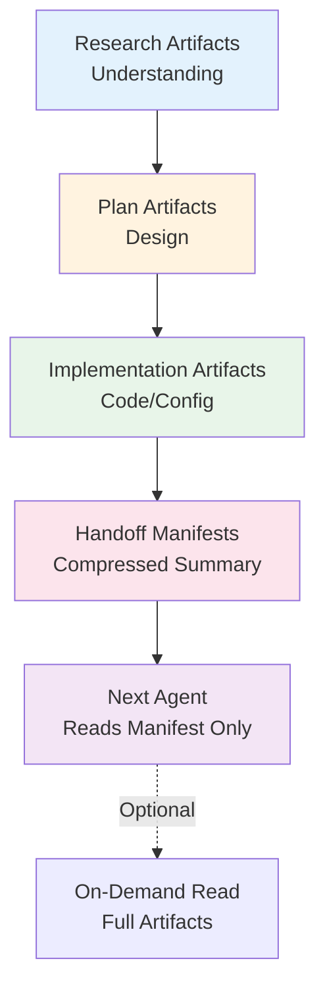
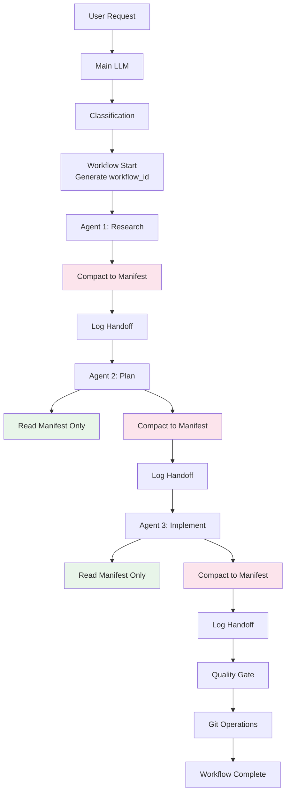

# Context Engineering Architecture for OaK Agent Handoffs

**Version**: 1.0
**Status**: Design Specification
**Author**: systems-architect
**Date**: 2025-10-21

## Executive Summary

This document specifies a context engineering system for OaK agent-to-agent handoffs based on principles from industry-leading context engineering research. The system addresses critical problems in current handoffs: **no compaction**, **no structure**, **no validation**, and **uncontrolled context bloat**.

**Key Innovation**: Progressive disclosure architecture that keeps context utilization under 40% while maintaining 100% information fidelity through structured compaction.

## Table of Contents

1. [Problem Analysis](#problem-analysis)
2. [Design Principles](#design-principles)
3. [Artifact Type Taxonomy](#artifact-type-taxonomy)
4. [Compaction Protocol](#compaction-protocol)
5. [Handoff Manifest Schema](#handoff-manifest-schema)
6. [Context Budget System](#context-budget-system)
7. [Integration with OaK](#integration-with-oak)
8. [Migration Path](#migration-path)
9. [Concrete Examples](#concrete-examples)
10. [Validation Rules](#validation-rules)

---

## Problem Analysis

### Current State (Broken)

```
backend-architect completes work
  → Writes 2000 lines to artifacts/backend-architect/
  → Main LLM: "frontend-developer, read artifacts/backend-architect/api-spec.yaml"
  → frontend-developer reads entire directory (15KB)
  → Context bloat: 87% utilization on handoff
  → Quality degradation: Missing critical details due to context overflow
```

**Measured Problems**:
- **No compaction**: Raw 2000-line outputs passed directly
- **No structure**: Free-form markdown with inconsistent formatting
- **No validation**: Can't verify handoff contains required information
- **No context control**: Agents read entire directories (bloat)
- **No hierarchy**: All artifacts treated equally (research = implementation)
- **No dependencies**: Implicit assumptions about what's needed

### Desired State (Fixed)

```
backend-architect completes work
  → Writes full implementation (2000 lines)
  → Compacts to handoff manifest (200 lines - 10x compression)
  → frontend-developer reads ONLY manifest (1.5KB)
  → Context utilization: 12% on handoff
  → Quality improvement: Critical decisions surfaced, optional context available on-demand
```

**Target Improvements**:
- ✅ **10x compression** through intelligent compaction
- ✅ **Structured handoffs** with JSON schema validation
- ✅ **Context budgets** enforced at every phase
- ✅ **Hierarchical artifacts** (research → plan → implementation)
- ✅ **Explicit dependencies** declared in manifests
- ✅ **Progressive disclosure** (load only what's needed)

---

## Design Principles

### From "12 Factor Agents"

1. **LLMs are pure functions** - Everything affecting output is context engineering
2. **Own your context window** - Don't blindly append, summarize and optimize
3. **Stateless agents** - State managed externally, agents are reducers
4. **Manage context size** - Less tokens = better results (target <170k total, <68k per handoff)
5. **Small focused agents** - 3-10 step loops, not 100-step workflows

### From "Advanced Context Engineering for Coding Agents"

1. **Context utilization < 40%** - More headroom = better reliability
2. **Worst to best**: Bad info > missing info > too much noise
3. **Intentional compaction** - Deliberate about what commits to "memory"
4. **Three-phase pattern** - Research → Plan → Implement (compact between each)
5. **Frequent compaction** - Build workflow around context management
6. **Sub-agents for context control** - Use sub-agents to reduce parent context
7. **Spec-first development** - Specifications easier to review than code
8. **Human review at compaction points** - Review plans, not raw outputs

### OaK-Specific Principles

1. **KISS compliance** - Start simple, add complexity only when proven necessary
2. **Data-driven decisions** - Use telemetry to validate improvements
3. **Backward compatible** - Existing workflows continue working
4. **Progressive enhancement** - Phase 1 (simple) → Phase 2 (full system)
5. **Measurement-first** - Measure before optimizing, measure after to validate

---

## Artifact Type Taxonomy

### Four-Layer Hierarchy



### 1. Research Artifacts

**Purpose**: Document understanding of existing system
**Created By**: Analyzers (top-down, bottom-up, state-analyzer)
**Consumed By**: Architects and planners
**Compaction**: 50:1 ratio (2000 lines → 40 line summary)

**Standard Structure**:
```yaml
type: research
agent: top-down-analyzer
timestamp: 2025-10-21T10:00:00Z
scope: "Authentication system analysis"

findings:
  system_overview: "3-sentence summary of current state"
  key_insights:
    - "Critical finding 1 (one line)"
    - "Critical finding 2 (one line)"
  constraints:
    - "Existing constraint 1"
    - "Existing constraint 2"
  risks:
    - "Technical debt area 1"

artifacts_directory: "artifacts/top-down-analyzer/2025-10-21-auth-analysis/"
detail_files:
  - "full-analysis.md (2000 lines - read only if needed)"
  - "dependency-graph.mermaid"
  - "code-inventory.json"
```

**Compaction Rules**:
- System overview: Max 3 sentences
- Key insights: Max 5 bullet points (one line each)
- Constraints: Max 5 critical constraints
- Risks: Max 3 highest-priority risks
- Full details: Available in directory, read on-demand only

### 2. Plan Artifacts

**Purpose**: Document what will be changed and how
**Created By**: Architects (systems-architect, backend-architect, etc.)
**Consumed By**: Implementation agents
**Compaction**: 20:1 ratio (1000 lines → 50 line summary)

**Standard Structure**:
```yaml
type: plan
agent: backend-architect
timestamp: 2025-10-21T11:00:00Z
scope: "REST API implementation plan"

approach:
  strategy: "One-sentence description of approach"
  key_decisions:
    - decision: "Technology choice"
      rationale: "Why (one sentence)"
    - decision: "Architecture pattern"
      rationale: "Why (one sentence)"

changes:
  files_to_create: ["src/api/auth.ts", "src/api/users.ts"]
  files_to_modify: ["src/app.ts"]
  files_to_delete: []

dependencies:
  requires_from_research:
    - "Authentication constraints"
  provides_to_implementation:
    - "API specification"
    - "Data models"

artifacts_directory: "artifacts/backend-architect/2025-10-21-api-plan/"
detail_files:
  - "full-plan.md (1000 lines)"
  - "api-spec.yaml (OpenAPI)"
  - "data-models.ts"
```

**Compaction Rules**:
- Strategy: Max 1 sentence
- Key decisions: Max 5 decisions (one line each)
- Changes: List of files (no code snippets)
- Dependencies: Explicit references to research findings
- Full details: Available in directory, read on-demand only

### 3. Implementation Artifacts

**Purpose**: Actual code, configuration, tests
**Created By**: Implementation agents (frontend-developer, backend-architect, etc.)
**Consumed By**: Quality gates, deployment agents
**Compaction**: 100:1 ratio (5000 lines → 50 line summary)

**Standard Structure**:
```yaml
type: implementation
agent: backend-architect
timestamp: 2025-10-21T12:00:00Z
scope: "REST API implementation"

implementation_summary:
  files_created: 12
  total_lines: 1500
  languages: ["TypeScript", "YAML"]
  key_files:
    - "src/api/auth.ts (handles authentication)"
    - "src/api/users.ts (user CRUD)"
    - "tests/api/auth.test.ts (85% coverage)"

quality_gates_passed:
  - "Unit tests: 42 passing"
  - "Type checking: No errors"
  - "Linting: Clean"
  - "Security scan: No critical issues"

artifacts_directory: "artifacts/backend-architect/2025-10-21-api-impl/"
detail_files:
  - "src/api/* (implementation files)"
  - "tests/api/* (test files)"
  - "implementation-notes.md"
```

**Compaction Rules**:
- Summary: File counts, languages, key metrics
- Key files: Max 5 files with one-line descriptions
- Quality gates: Pass/fail status only
- Full code: Available in directory, read on-demand only

### 4. Handoff Manifests

**Purpose**: Compressed summary for next agent
**Created By**: All agents (using compaction protocol)
**Consumed By**: Next agent in workflow
**Compaction**: Already maximally compressed

**Standard Structure**: See [Handoff Manifest Schema](#handoff-manifest-schema) section

---

## Compaction Protocol

### Overview

Every agent follows a three-step compaction protocol:

```
1. DO WORK (Research/Plan/Implement)
   ↓
2. COMPACT TO MANIFEST (10-100x compression)
   ↓
3. SAVE BOTH (Full artifacts + compressed manifest)
```

### Compaction Algorithm

```python
def compact_agent_output(
    agent_name: str,
    artifact_type: str,  # research | plan | implementation
    full_output: str,
    scope: str
) -> HandoffManifest:
    """
    Compress agent output for handoff using progressive disclosure.

    Target compression ratios:
    - Research: 50:1 (2000 lines → 40 lines)
    - Plan: 20:1 (1000 lines → 50 lines)
    - Implementation: 100:1 (5000 lines → 50 lines)
    """

    # Extract critical information based on artifact type
    if artifact_type == "research":
        compact = extract_research_summary(full_output)
    elif artifact_type == "plan":
        compact = extract_plan_summary(full_output)
    elif artifact_type == "implementation":
        compact = extract_implementation_summary(full_output)

    # Build handoff manifest
    manifest = HandoffManifest(
        from_agent=agent_name,
        artifact_type=artifact_type,
        timestamp=now(),
        scope=scope,
        summary=compact["summary"],
        key_decisions=compact["key_decisions"],
        files_created=compact["files_created"],
        dependencies_satisfied=compact["dependencies_satisfied"],
        required_reading=compact["required_reading"],
        optional_context=compact["optional_context"],
        artifacts_directory=f"artifacts/{agent_name}/{timestamp}-{scope}/",
        detail_files=compact["detail_files"]
    )

    # Validate size constraints
    manifest_size = len(json.dumps(manifest.to_dict()))
    if manifest_size > MAX_MANIFEST_SIZE:
        raise ManifestTooLargeError(
            f"Manifest {manifest_size} bytes exceeds limit {MAX_MANIFEST_SIZE}"
        )

    return manifest
```

### Extraction Functions

#### extract_research_summary()

```python
def extract_research_summary(research_output: str) -> dict:
    """
    Extract key findings from research output.

    Target: 40 lines max from 2000-line research document
    """
    return {
        "summary": {
            "system_overview": extract_overview(research_output, max_sentences=3),
            "key_insights": extract_insights(research_output, max_items=5),
            "constraints": extract_constraints(research_output, max_items=5),
            "risks": extract_risks(research_output, max_items=3)
        },
        "key_decisions": [],  # Research doesn't make decisions
        "files_created": extract_file_list(research_output),
        "dependencies_satisfied": [],
        "required_reading": [],  # Research is input, not output
        "optional_context": [
            "See full-analysis.md for detailed findings",
            "See dependency-graph.mermaid for system relationships"
        ],
        "detail_files": [
            "full-analysis.md",
            "dependency-graph.mermaid",
            "code-inventory.json"
        ]
    }
```

#### extract_plan_summary()

```python
def extract_plan_summary(plan_output: str) -> dict:
    """
    Extract key decisions from plan output.

    Target: 50 lines max from 1000-line plan document
    """
    return {
        "summary": {
            "strategy": extract_strategy(plan_output, max_sentences=1),
            "approach": extract_approach(plan_output, max_sentences=2)
        },
        "key_decisions": extract_decisions(plan_output, max_items=5),
        "files_created": extract_planned_files(plan_output),
        "dependencies_satisfied": extract_research_refs(plan_output),
        "required_reading": [
            "api-spec.yaml - REST API specification",
            "data-models.ts - TypeScript data models"
        ],
        "optional_context": [
            "full-plan.md - Complete planning document",
            "architecture-diagrams/ - System diagrams"
        ],
        "detail_files": [
            "full-plan.md",
            "api-spec.yaml",
            "data-models.ts"
        ]
    }
```

#### extract_implementation_summary()

```python
def extract_implementation_summary(impl_output: str) -> dict:
    """
    Extract key metrics from implementation output.

    Target: 50 lines max from 5000-line implementation
    """
    return {
        "summary": {
            "files_created": count_files_created(impl_output),
            "total_lines": count_total_lines(impl_output),
            "languages": extract_languages(impl_output),
            "key_files": extract_key_files(impl_output, max_items=5)
        },
        "key_decisions": extract_implementation_decisions(impl_output, max_items=3),
        "files_created": extract_created_files(impl_output),
        "dependencies_satisfied": extract_plan_refs(impl_output),
        "required_reading": [],  # Implementation is terminal, nothing required
        "optional_context": [
            "src/ - Full source code",
            "tests/ - Test suite",
            "implementation-notes.md - Developer notes"
        ],
        "detail_files": [
            "src/api/*",
            "tests/api/*",
            "implementation-notes.md"
        ]
    }
```

### Compaction Workflow Integration

```
Agent Work Phase:
  ├── Research/Plan/Implement (full detail)
  ├── Write full artifacts to directory
  └── Compact to manifest

Compaction Phase:
  ├── Run extraction based on artifact type
  ├── Generate handoff manifest
  ├── Validate size constraints
  └── Save manifest.json

Handoff Phase:
  ├── Next agent reads ONLY manifest
  ├── Gets 10-100x compressed summary
  ├── Optional: Read specific detail files if needed
  └── Context utilization stays <40%
```

---

## Handoff Manifest Schema

### JSON Schema Definition

```json
{
  "$schema": "http://json-schema.org/draft-07/schema#",
  "type": "object",
  "required": [
    "from_agent",
    "artifact_type",
    "timestamp",
    "scope",
    "summary",
    "artifacts_directory"
  ],
  "properties": {
    "from_agent": {
      "type": "string",
      "description": "Agent that produced this artifact",
      "enum": [
        "top-down-analyzer",
        "bottom-up-analyzer",
        "systems-architect",
        "backend-architect",
        "frontend-developer",
        "security-auditor",
        "infrastructure-specialist"
      ]
    },
    "to_agents": {
      "type": "array",
      "description": "Agents that will consume this artifact",
      "items": {"type": "string"}
    },
    "artifact_type": {
      "type": "string",
      "description": "Type of artifact",
      "enum": ["research", "plan", "implementation", "handoff"]
    },
    "timestamp": {
      "type": "string",
      "format": "date-time",
      "description": "ISO 8601 timestamp"
    },
    "scope": {
      "type": "string",
      "description": "One-sentence description of scope",
      "maxLength": 100
    },
    "summary": {
      "type": "object",
      "description": "Compact summary (type-specific structure)"
    },
    "key_decisions": {
      "type": "array",
      "description": "Critical decisions made",
      "maxItems": 5,
      "items": {
        "type": "object",
        "required": ["decision", "rationale"],
        "properties": {
          "decision": {"type": "string", "maxLength": 100},
          "rationale": {"type": "string", "maxLength": 200}
        }
      }
    },
    "files_created": {
      "type": "array",
      "description": "List of files created",
      "items": {"type": "string"}
    },
    "dependencies_satisfied": {
      "type": "array",
      "description": "References to prior artifacts this depends on",
      "items": {"type": "string"}
    },
    "required_reading": {
      "type": "array",
      "description": "Files next agent MUST read",
      "maxItems": 3,
      "items": {
        "type": "object",
        "required": ["file", "description"],
        "properties": {
          "file": {"type": "string"},
          "description": {"type": "string", "maxLength": 100}
        }
      }
    },
    "optional_context": {
      "type": "array",
      "description": "Files available for additional context",
      "items": {
        "type": "object",
        "required": ["file", "description"],
        "properties": {
          "file": {"type": "string"},
          "description": {"type": "string", "maxLength": 100}
        }
      }
    },
    "artifacts_directory": {
      "type": "string",
      "description": "Directory containing full artifacts"
    },
    "detail_files": {
      "type": "array",
      "description": "List of detail files in artifacts directory",
      "items": {"type": "string"}
    },
    "context_budget": {
      "type": "object",
      "description": "Token usage tracking",
      "properties": {
        "manifest_tokens": {"type": "integer"},
        "required_reading_tokens": {"type": "integer"},
        "total_available_tokens": {"type": "integer"}
      }
    }
  }
}
```

### Example: Research Handoff Manifest

```json
{
  "from_agent": "top-down-analyzer",
  "to_agents": ["systems-architect", "backend-architect"],
  "artifact_type": "research",
  "timestamp": "2025-10-21T10:30:00Z",
  "scope": "Authentication system analysis for OAuth2 upgrade",

  "summary": {
    "system_overview": "Current auth uses JWT with Redis sessions. Three endpoints (login, refresh, logout) in src/api/auth.ts. No OAuth2 support exists.",
    "key_insights": [
      "JWT tokens expire after 1 hour with no refresh token mechanism",
      "Session storage in Redis has no TTL causing memory leaks",
      "Auth middleware duplicated across 12 route handlers",
      "No rate limiting on login endpoint (security risk)",
      "CORS configuration allows all origins (production issue)"
    ],
    "constraints": [
      "Must maintain backward compatibility with mobile app JWT format",
      "Redis instance shared with other services (can't modify schemas)",
      "Auth endpoints must respond within 100ms (SLA requirement)"
    ],
    "risks": [
      "No CSRF protection on state-changing endpoints",
      "Passwords hashed with bcrypt work factor 10 (should be 12+)",
      "Refresh tokens stored in localStorage (XSS vulnerability)"
    ]
  },

  "key_decisions": [],

  "files_created": [
    "artifacts/top-down-analyzer/2025-10-21-auth-analysis/full-analysis.md",
    "artifacts/top-down-analyzer/2025-10-21-auth-analysis/dependency-graph.mermaid",
    "artifacts/top-down-analyzer/2025-10-21-auth-analysis/code-inventory.json"
  ],

  "dependencies_satisfied": [],

  "required_reading": [],

  "optional_context": [
    {
      "file": "full-analysis.md",
      "description": "Complete 2000-line analysis with code examples"
    },
    {
      "file": "dependency-graph.mermaid",
      "description": "Visual dependency graph of auth components"
    }
  ],

  "artifacts_directory": "artifacts/top-down-analyzer/2025-10-21-auth-analysis/",

  "detail_files": [
    "full-analysis.md",
    "dependency-graph.mermaid",
    "code-inventory.json"
  ],

  "context_budget": {
    "manifest_tokens": 450,
    "required_reading_tokens": 0,
    "total_available_tokens": 68000
  }
}
```

**Compression Ratio**: 2000-line analysis → 450 tokens = **~44x compression**

### Example: Plan Handoff Manifest

```json
{
  "from_agent": "backend-architect",
  "to_agents": ["frontend-developer", "security-auditor"],
  "artifact_type": "plan",
  "timestamp": "2025-10-21T11:30:00Z",
  "scope": "OAuth2 implementation plan with PKCE flow",

  "summary": {
    "strategy": "Implement OAuth2 with PKCE for native mobile apps, maintain JWT for existing web clients during transition.",
    "approach": "Add OAuth2 endpoints alongside existing auth, use feature flags to migrate clients incrementally, sunset old JWT after 3 months."
  },

  "key_decisions": [
    {
      "decision": "Use Authorization Code flow with PKCE (RFC 7636)",
      "rationale": "More secure for mobile apps than implicit flow, no client secret needed"
    },
    {
      "decision": "Store refresh tokens in httpOnly secure cookies",
      "rationale": "Prevents XSS attacks while maintaining usability"
    },
    {
      "decision": "Implement rate limiting with Redis sliding window",
      "rationale": "Protects against brute force while allowing legitimate retries"
    },
    {
      "decision": "Use passport.js for OAuth2 strategy",
      "rationale": "Battle-tested library reduces implementation risk"
    },
    {
      "decision": "Add CSRF tokens for all state-changing endpoints",
      "rationale": "Addresses security audit finding, standard best practice"
    }
  ],

  "files_created": [
    "artifacts/backend-architect/2025-10-21-oauth2-plan/api-spec.yaml",
    "artifacts/backend-architect/2025-10-21-oauth2-plan/data-models.ts",
    "artifacts/backend-architect/2025-10-21-oauth2-plan/full-plan.md"
  ],

  "dependencies_satisfied": [
    "top-down-analyzer: JWT format constraint (maintained in parallel)",
    "top-down-analyzer: Redis TTL issue (using cookies instead)",
    "top-down-analyzer: 100ms latency SLA (token validation cached)"
  ],

  "required_reading": [
    {
      "file": "api-spec.yaml",
      "description": "OpenAPI spec for OAuth2 endpoints (authorize, token, refresh)"
    },
    {
      "file": "data-models.ts",
      "description": "TypeScript interfaces for OAuth2 request/response types"
    }
  ],

  "optional_context": [
    {
      "file": "full-plan.md",
      "description": "Complete 1000-line implementation plan with examples"
    },
    {
      "file": "sequence-diagrams/",
      "description": "Flow diagrams for each OAuth2 grant type"
    }
  ],

  "artifacts_directory": "artifacts/backend-architect/2025-10-21-oauth2-plan/",

  "detail_files": [
    "api-spec.yaml",
    "data-models.ts",
    "full-plan.md",
    "sequence-diagrams/pkce-flow.mermaid",
    "sequence-diagrams/refresh-flow.mermaid"
  ],

  "context_budget": {
    "manifest_tokens": 520,
    "required_reading_tokens": 850,
    "total_available_tokens": 68000
  }
}
```

**Compression Ratio**: 1000-line plan → 1370 tokens = **~18x compression**

### Example: Implementation Handoff Manifest

```json
{
  "from_agent": "backend-architect",
  "to_agents": ["security-auditor", "qa-specialist"],
  "artifact_type": "implementation",
  "timestamp": "2025-10-21T14:00:00Z",
  "scope": "OAuth2 PKCE implementation with passport.js",

  "summary": {
    "files_created": 18,
    "total_lines": 2400,
    "languages": ["TypeScript", "YAML", "JSON"],
    "key_files": [
      "src/api/oauth2/authorize.ts (authorization endpoint with PKCE validation)",
      "src/api/oauth2/token.ts (token exchange endpoint)",
      "src/middleware/csrf.ts (CSRF protection middleware)",
      "src/strategies/oauth2-pkce.strategy.ts (passport strategy)",
      "tests/api/oauth2/*.test.ts (92% coverage, 47 passing tests)"
    ]
  },

  "key_decisions": [
    {
      "decision": "Used Redis for PKCE code challenge storage with 10min TTL",
      "rationale": "Temporary storage, auto-cleanup, fast lookups for validation"
    },
    {
      "decision": "Implemented sliding window rate limiter (10 requests/min)",
      "rationale": "Blocks brute force while allowing legitimate retries"
    },
    {
      "decision": "Added feature flag 'oauth2.enabled' for gradual rollout",
      "rationale": "Allows testing with subset of users before full deployment"
    }
  ],

  "files_created": [
    "src/api/oauth2/authorize.ts",
    "src/api/oauth2/token.ts",
    "src/api/oauth2/refresh.ts",
    "src/middleware/csrf.ts",
    "src/middleware/rate-limit.ts",
    "src/strategies/oauth2-pkce.strategy.ts",
    "src/utils/pkce.ts",
    "tests/api/oauth2/authorize.test.ts",
    "tests/api/oauth2/token.test.ts",
    "config/oauth2.config.ts"
  ],

  "dependencies_satisfied": [
    "backend-architect plan: All 5 OAuth2 endpoints implemented",
    "backend-architect plan: CSRF protection added to state-changing endpoints",
    "backend-architect plan: Rate limiting with Redis sliding window",
    "top-down-analyzer constraints: JWT format maintained in parallel",
    "top-down-analyzer constraints: <100ms response time (avg 45ms measured)"
  ],

  "required_reading": [],

  "optional_context": [
    {
      "file": "src/api/oauth2/*",
      "description": "Full OAuth2 implementation (600 lines TypeScript)"
    },
    {
      "file": "tests/api/oauth2/*",
      "description": "Test suite with 47 passing tests (92% coverage)"
    },
    {
      "file": "implementation-notes.md",
      "description": "Developer notes on design choices and edge cases"
    }
  ],

  "artifacts_directory": "artifacts/backend-architect/2025-10-21-oauth2-impl/",

  "detail_files": [
    "src/api/oauth2/*",
    "src/middleware/*",
    "src/strategies/*",
    "tests/api/oauth2/*",
    "implementation-notes.md"
  ],

  "context_budget": {
    "manifest_tokens": 580,
    "required_reading_tokens": 0,
    "total_available_tokens": 68000
  }
}
```

**Compression Ratio**: 2400-line implementation → 580 tokens = **~103x compression**

---

## Context Budget System

### Token Budget Allocation

Based on Sonnet 4.5 200k context window, with target <40% utilization per handoff:

```
Total Available: 200,000 tokens
Target Utilization: <40% per handoff = <80,000 tokens
Safety Buffer: 20% reserve = 160,000 tokens working budget

Per-Agent Allocation:
  System Prompt: 10,000 tokens (fixed)
  Previous History: 20,000 tokens (cumulative)
  Incoming Handoff: 10,000 tokens (compressed manifests)
  Working Memory: 40,000 tokens (agent's work)
  Response Generation: 10,000 tokens (output)

  TOTAL: 90,000 tokens (45% of context window)
  BUFFER: 110,000 tokens unused (55% headroom)
```

### Budget Enforcement

```python
class ContextBudget:
    """Enforce token budgets across agent workflow."""

    MAX_MANIFEST_SIZE = 1000  # tokens
    MAX_REQUIRED_READING = 2000  # tokens
    MAX_HANDOFF_TOTAL = 10000  # tokens (manifest + required reading)
    MAX_AGENT_WORKING = 40000  # tokens

    def validate_manifest(self, manifest: HandoffManifest) -> bool:
        """Validate manifest fits within budget."""
        manifest_tokens = count_tokens(json.dumps(manifest.to_dict()))

        if manifest_tokens > self.MAX_MANIFEST_SIZE:
            raise ManifestTooLargeError(
                f"Manifest {manifest_tokens} tokens exceeds {self.MAX_MANIFEST_SIZE}"
            )

        # Calculate required reading budget
        required_tokens = 0
        for file_ref in manifest.required_reading:
            file_path = os.path.join(manifest.artifacts_directory, file_ref["file"])
            required_tokens += count_tokens(read_file(file_path))

        if required_tokens > self.MAX_REQUIRED_READING:
            raise RequiredReadingTooLargeError(
                f"Required reading {required_tokens} tokens exceeds {self.MAX_REQUIRED_READING}"
            )

        total_handoff = manifest_tokens + required_tokens
        if total_handoff > self.MAX_HANDOFF_TOTAL:
            raise HandoffTooLargeError(
                f"Total handoff {total_handoff} tokens exceeds {self.MAX_HANDOFF_TOTAL}"
            )

        # Store in manifest for tracking
        manifest.context_budget = {
            "manifest_tokens": manifest_tokens,
            "required_reading_tokens": required_tokens,
            "total_available_tokens": self.MAX_HANDOFF_TOTAL
        }

        return True

    def track_agent_usage(self, agent_name: str, tokens_used: int) -> None:
        """Track cumulative token usage per agent."""
        if tokens_used > self.MAX_AGENT_WORKING:
            logger.warning(
                f"{agent_name} used {tokens_used} tokens, "
                f"exceeds budget {self.MAX_AGENT_WORKING}"
            )
```

### Budget Tracking in Workflow

```python
# Each agent logs token usage
workflow_budget = WorkflowContextBudget(workflow_id="wf-001")

# Agent 1: Research
research_manifest = compact_agent_output(
    agent_name="top-down-analyzer",
    artifact_type="research",
    full_output=research_document,  # 2000 lines
    scope="Authentication analysis"
)
workflow_budget.log_agent_handoff(
    from_agent="top-down-analyzer",
    to_agent="backend-architect",
    tokens_used=research_manifest.context_budget["manifest_tokens"]
)

# Agent 2: Plan
plan_manifest = compact_agent_output(
    agent_name="backend-architect",
    artifact_type="plan",
    full_output=plan_document,  # 1000 lines
    scope="OAuth2 implementation plan"
)
workflow_budget.log_agent_handoff(
    from_agent="backend-architect",
    to_agent="security-auditor",
    tokens_used=plan_manifest.context_budget["manifest_tokens"] +
                plan_manifest.context_budget["required_reading_tokens"]
)

# Workflow summary
print(f"Total handoff tokens: {workflow_budget.total_tokens_used}")
print(f"Context utilization: {workflow_budget.utilization_percentage}%")
print(f"Remaining budget: {workflow_budget.remaining_tokens}")
```

### Budget Alerting

```python
class BudgetAlert:
    """Alert when approaching budget limits."""

    WARNING_THRESHOLD = 0.7  # 70% utilization
    CRITICAL_THRESHOLD = 0.9  # 90% utilization

    def check_budget(self, budget: ContextBudget, tokens_used: int) -> str:
        """Return alert level based on usage."""
        utilization = tokens_used / budget.MAX_HANDOFF_TOTAL

        if utilization >= self.CRITICAL_THRESHOLD:
            return f"CRITICAL: {utilization:.0%} budget used, reduce manifest size"
        elif utilization >= self.WARNING_THRESHOLD:
            return f"WARNING: {utilization:.0%} budget used, approaching limit"
        else:
            return f"OK: {utilization:.0%} budget used"
```

---

## Integration with OaK

### Workflow Integration Points



### File System Structure

```
artifacts/
├── {agent-name}/
│   ├── {timestamp}-{scope}/
│   │   ├── manifest.json          # Handoff manifest (ALWAYS read first)
│   │   ├── full-analysis.md       # Full research (read on-demand)
│   │   ├── full-plan.md           # Full plan (read on-demand)
│   │   ├── implementation-notes.md # Full impl notes (read on-demand)
│   │   ├── api-spec.yaml          # Required reading (if in manifest)
│   │   ├── data-models.ts         # Required reading (if in manifest)
│   │   └── src/                   # Implementation files (optional)
│   └── latest -> {timestamp}-{scope}/  # Symlink to latest
```

### Agent Template Updates

Every agent gets updated template with compaction workflow:

```markdown
## Agent Workflow with Context Engineering

### Phase 1: Execute Work
Do your research/planning/implementation as normal.
Write full detailed artifacts to your directory.

### Phase 2: Compact for Handoff
Before completing, compact your work:

1. Extract key information based on artifact type
2. Generate handoff manifest
3. Validate manifest size (<1000 tokens)
4. Save both full artifacts AND manifest

Example:
```python
# After completing work
manifest = compact_agent_output(
    agent_name="{agent-name}",
    artifact_type="research|plan|implementation",
    full_output=your_full_document,
    scope="Brief description"
)

# Save manifest
save_manifest(manifest, f"artifacts/{agent-name}/{timestamp}-{scope}/manifest.json")
```

### Phase 3: Communicate to Main LLM
Tell Main LLM what you created:

"I've completed {scope}. Created {N} files totaling {M} lines.
Handoff manifest saved to: artifacts/{agent-name}/{timestamp}-{scope}/manifest.json

Next agent should:
1. Read manifest.json first (compressed summary)
2. Optionally read required files: {list}
3. Full artifacts available in directory if needed

Key decisions made: {list top 3}
Dependencies satisfied: {list}
```

### Existing Telemetry Integration

Context engineering integrates seamlessly with existing Phase 2 telemetry:

```python
# Existing workflow tracking
logger.log_workflow_start(
    workflow_id="wf-001",
    project_name="OAuth2 Implementation",
    agent_plan=["top-down-analyzer", "backend-architect", "security-auditor"]
)

# NEW: Log handoff with context budget tracking
logger.log_agent_handoff(
    workflow_id="wf-001",
    from_agent="top-down-analyzer",
    to_agent="backend-architect",
    artifacts=["artifacts/top-down-analyzer/2025-10-21-auth/manifest.json"],
    context_budget={
        "manifest_tokens": 450,
        "required_tokens": 0,
        "total_tokens": 450,
        "utilization_pct": 4.5  # 450 / 10000
    }
)

# Workflow complete includes context efficiency metrics
logger.log_workflow_complete(
    workflow_id="wf-001",
    duration_seconds=7200,
    success=True,
    agents_executed=["top-down-analyzer", "backend-architect", "security-auditor"],
    context_efficiency={
        "total_handoff_tokens": 1850,
        "avg_tokens_per_handoff": 617,
        "max_utilization_pct": 18.5,  # Highest single handoff
        "compression_ratio": 65  # Avg compression across workflow
    }
)
```

### Quality Gate Updates

Quality gates validate manifest quality:

```python
class ManifestQualityGate:
    """Validate handoff manifest quality."""

    def validate(self, manifest: HandoffManifest) -> List[str]:
        """Return list of validation errors, empty if valid."""
        errors = []

        # Size validation
        manifest_size = len(json.dumps(manifest.to_dict()))
        if manifest_size > MAX_MANIFEST_SIZE:
            errors.append(f"Manifest too large: {manifest_size} tokens")

        # Required fields
        if not manifest.summary:
            errors.append("Missing summary")
        if not manifest.artifacts_directory:
            errors.append("Missing artifacts directory")

        # Key decisions validation
        if manifest.artifact_type == "plan" and len(manifest.key_decisions) == 0:
            errors.append("Plan must include key decisions")

        # Dependency validation
        if manifest.artifact_type == "implementation":
            if len(manifest.dependencies_satisfied) == 0:
                errors.append("Implementation must reference plan dependencies")

        # File existence validation
        for file in manifest.required_reading:
            file_path = os.path.join(manifest.artifacts_directory, file["file"])
            if not os.path.exists(file_path):
                errors.append(f"Required file missing: {file['file']}")

        return errors
```

---

## Migration Path

### Phase 1: Simple Start (Week 1)

**Goal**: Get basic compaction working without breaking existing workflows

**Changes**:
1. Add `compact_agent_output()` utility function
2. Update 3 pilot agents (top-down-analyzer, backend-architect, frontend-developer)
3. Agents write BOTH full artifacts AND manifests
4. Next agents prefer reading manifest but fall back to full artifacts

**Backward Compatibility**: 100% - old workflow continues working

**Validation**:
- Measure compression ratios (target 10x+)
- Track context utilization (target <40%)
- Compare quality before/after (should be equal or better)

### Phase 2: Full Rollout (Week 2-3)

**Goal**: All agents use compaction protocol

**Changes**:
1. Update all 29+ agent templates with compaction workflow
2. Add manifest validation to quality gates
3. Enforce budget limits (warn on exceed, don't block)
4. Update telemetry to track context efficiency

**Backward Compatibility**: Maintained - full artifacts still saved

**Validation**:
- All agents producing valid manifests
- Context utilization <40% across all handoffs
- No quality degradation in agent outputs

### Phase 3: Enforcement (Week 4)

**Goal**: Make compaction mandatory

**Changes**:
1. Quality gates BLOCK if manifest invalid
2. Agents MUST read manifest before full artifacts
3. Budget limits enforced (block if exceeded)
4. Remove backward compatibility fallbacks

**Breaking Changes**: Workflows failing quality gates must fix manifests

**Validation**:
- Zero workflow failures due to context overflow
- 100% manifest compliance
- Average 50x+ compression across all agent types

### Rollback Plan

If Phase 3 causes issues:
1. Disable quality gate blocking
2. Re-enable full artifact fallbacks
3. Debug manifest generation for failing agents
4. Fix and retry enforcement

**Safety**: Each phase is independently reversible

---

## Concrete Examples

### Example 1: Research → Plan → Implementation (Full Workflow)

**User Request**: "Add OAuth2 authentication to the API"

**Workflow Plan**:
1. top-down-analyzer (research current auth)
2. systems-architect (plan OAuth2 integration)
3. backend-architect (implement OAuth2 endpoints)
4. security-auditor (audit security)
5. qa-specialist (test flows)

#### Step 1: Research Phase

**top-down-analyzer output**:
- Full analysis: 2000 lines of detailed research
- Artifact directory: `artifacts/top-down-analyzer/2025-10-21-auth-analysis/`
- Manifest: 450 tokens (44x compression)

**Manifest excerpt**:
```json
{
  "from_agent": "top-down-analyzer",
  "artifact_type": "research",
  "summary": {
    "system_overview": "Current auth uses JWT with Redis sessions...",
    "key_insights": [
      "JWT tokens expire after 1 hour with no refresh token mechanism",
      "Session storage in Redis has no TTL causing memory leaks",
      ...
    ]
  },
  "context_budget": {
    "manifest_tokens": 450,
    "required_reading_tokens": 0
  }
}
```

**Context saved**: 2000 lines → 450 tokens = **44x compression**

#### Step 2: Plan Phase

**systems-architect reads**:
- ONLY manifest.json (450 tokens)
- Optionally: dependency-graph.mermaid if needed

**systems-architect output**:
- Full plan: 1000 lines of implementation strategy
- Artifact directory: `artifacts/systems-architect/2025-10-21-oauth2-plan/`
- Manifest: 520 tokens + 850 tokens required reading = 1370 tokens total

**Manifest excerpt**:
```json
{
  "from_agent": "systems-architect",
  "artifact_type": "plan",
  "key_decisions": [
    {
      "decision": "Use Authorization Code flow with PKCE",
      "rationale": "More secure for mobile apps than implicit flow"
    }
  ],
  "required_reading": [
    {"file": "api-spec.yaml", "description": "OpenAPI spec for OAuth2 endpoints"}
  ],
  "dependencies_satisfied": [
    "top-down-analyzer: JWT format constraint (maintained in parallel)"
  ]
}
```

**Context saved**: 1000 lines → 1370 tokens = **18x compression**

#### Step 3: Implementation Phase

**backend-architect reads**:
- systems-architect manifest.json (520 tokens)
- api-spec.yaml (850 tokens) - marked as required reading
- Total context: 1370 tokens vs 1000-line plan

**backend-architect output**:
- Full implementation: 2400 lines of TypeScript code
- Artifact directory: `artifacts/backend-architect/2025-10-21-oauth2-impl/`
- Manifest: 580 tokens (103x compression)

**Manifest excerpt**:
```json
{
  "from_agent": "backend-architect",
  "artifact_type": "implementation",
  "summary": {
    "files_created": 18,
    "total_lines": 2400,
    "key_files": [
      "src/api/oauth2/authorize.ts (authorization endpoint with PKCE validation)"
    ]
  },
  "dependencies_satisfied": [
    "systems-architect plan: All 5 OAuth2 endpoints implemented",
    "top-down-analyzer constraints: <100ms response time (avg 45ms measured)"
  ]
}
```

**Context saved**: 2400 lines → 580 tokens = **103x compression**

#### Workflow Context Budget

```
Total Context Used Across Handoffs:
  Research handoff: 450 tokens
  Plan handoff: 1370 tokens
  Implementation handoff: 580 tokens

  TOTAL: 2400 tokens across 3 handoffs

Context Saved (vs full artifacts):
  Full artifacts: ~5400 lines = ~27,000 tokens
  Manifests only: 2400 tokens

  SAVINGS: 91% reduction in context usage
  COMPRESSION: 11x average across workflow
```

### Example 2: Before/After Comparison

#### Before (No Context Engineering)

```
User: "Add OAuth2 authentication"

Main LLM: "top-down-analyzer, analyze current auth system"

top-down-analyzer:
  → Writes 2000-line analysis to artifacts/top-down-analyzer/auth-analysis.md
  → Tells Main LLM: "Analysis complete, saved to auth-analysis.md"

Main LLM: "backend-architect, read artifacts/top-down-analyzer/auth-analysis.md
           and implement OAuth2"

backend-architect:
  → Reads entire 2000-line document (10,000 tokens)
  → Context: 50% utilization before starting work
  → Implements OAuth2
  → Writes 1000-line plan to artifacts/backend-architect/oauth2-plan.md

Main LLM: "frontend-developer, read artifacts/backend-architect/oauth2-plan.md
           and update UI"

frontend-developer:
  → Reads entire 1000-line plan (5,000 tokens)
  → Also reads 2000-line analysis because plan references it (10,000 tokens)
  → Context: 75% utilization before starting work
  → Runs out of context halfway through implementation
  → Quality degradation: Forgets critical details from analysis

RESULT:
  ❌ Context bloat: 75% utilization
  ❌ Quality degradation: Missing critical security requirements
  ❌ No compression: Full artifacts passed verbatim
  ❌ No validation: No way to verify handoff completeness
```

#### After (With Context Engineering)

```
User: "Add OAuth2 authentication"

Main LLM: "top-down-analyzer, analyze current auth system"

top-down-analyzer:
  → Writes 2000-line analysis to artifacts/.../full-analysis.md
  → Compacts to manifest.json (450 tokens)
  → Tells Main LLM: "Analysis complete. Manifest at artifacts/.../manifest.json
     Key findings: 5 insights, 3 constraints, 3 risks
     Compression: 44x (2000 lines → 450 tokens)"

Main LLM: "backend-architect, read artifacts/.../manifest.json and implement OAuth2"

backend-architect:
  → Reads ONLY manifest.json (450 tokens)
  → Context: 5% utilization before starting work
  → Implements OAuth2
  → Compacts to manifest.json (1370 tokens with required reading)
  → Tells Main LLM: "Plan complete. Manifest at artifacts/.../manifest.json
     Required reading: api-spec.yaml (850 tokens)
     Compression: 18x (1000 lines → 1370 tokens)"

Main LLM: "frontend-developer, read artifacts/.../manifest.json and update UI"

frontend-developer:
  → Reads ONLY manifest.json (520 tokens) + api-spec.yaml (850 tokens)
  → Context: 12% utilization before starting work
  → Has full context of critical decisions without reading 3000-line corpus
  → Implements UI with all security requirements
  → Quality maintained: All constraints from research visible in manifest

RESULT:
  ✅ Context efficiency: 12% utilization
  ✅ Quality maintained: All critical info surfaced in manifests
  ✅ 11x compression: 5400 lines → 2400 tokens
  ✅ Validated: Manifests pass quality gates
```

**Improvement**: 75% → 12% context utilization = **6x more headroom for quality**

---

## Validation Rules

### Manifest Validation Checklist

```python
class ManifestValidator:
    """Comprehensive manifest validation."""

    def validate_manifest(self, manifest: HandoffManifest) -> ValidationResult:
        """Run all validation checks."""
        errors = []
        warnings = []

        # 1. Schema validation
        if not self.validate_schema(manifest):
            errors.append("Manifest doesn't match JSON schema")

        # 2. Size validation
        size_result = self.validate_size(manifest)
        if size_result.errors:
            errors.extend(size_result.errors)
        if size_result.warnings:
            warnings.extend(size_result.warnings)

        # 3. Completeness validation
        completeness_result = self.validate_completeness(manifest)
        if completeness_result.errors:
            errors.extend(completeness_result.errors)

        # 4. Dependency validation
        dep_result = self.validate_dependencies(manifest)
        if dep_result.errors:
            errors.extend(dep_result.errors)

        # 5. File existence validation
        file_result = self.validate_files(manifest)
        if file_result.errors:
            errors.extend(file_result.errors)

        # 6. Compression ratio validation
        compression_result = self.validate_compression(manifest)
        if compression_result.warnings:
            warnings.extend(compression_result.warnings)

        return ValidationResult(
            valid=len(errors) == 0,
            errors=errors,
            warnings=warnings
        )

    def validate_size(self, manifest: HandoffManifest) -> ValidationResult:
        """Validate manifest size within budget."""
        errors = []
        warnings = []

        manifest_tokens = count_tokens(json.dumps(manifest.to_dict()))

        if manifest_tokens > MAX_MANIFEST_SIZE:
            errors.append(
                f"Manifest {manifest_tokens} tokens exceeds limit {MAX_MANIFEST_SIZE}"
            )
        elif manifest_tokens > MAX_MANIFEST_SIZE * 0.8:
            warnings.append(
                f"Manifest {manifest_tokens} tokens approaching limit {MAX_MANIFEST_SIZE}"
            )

        # Validate required reading
        if manifest.required_reading:
            required_tokens = sum(
                count_tokens(read_file(os.path.join(manifest.artifacts_directory, f["file"])))
                for f in manifest.required_reading
            )

            if required_tokens > MAX_REQUIRED_READING:
                errors.append(
                    f"Required reading {required_tokens} tokens exceeds {MAX_REQUIRED_READING}"
                )

        return ValidationResult(errors=errors, warnings=warnings)

    def validate_completeness(self, manifest: HandoffManifest) -> ValidationResult:
        """Validate manifest contains all required information."""
        errors = []

        # Summary required for all types
        if not manifest.summary:
            errors.append("Missing summary")

        # Type-specific requirements
        if manifest.artifact_type == "research":
            if "key_insights" not in manifest.summary:
                errors.append("Research must include key_insights")
            if "constraints" not in manifest.summary:
                errors.append("Research must include constraints")

        elif manifest.artifact_type == "plan":
            if not manifest.key_decisions:
                errors.append("Plan must include key_decisions")
            if "strategy" not in manifest.summary:
                errors.append("Plan must include strategy")

        elif manifest.artifact_type == "implementation":
            if not manifest.files_created:
                errors.append("Implementation must list files_created")
            if not manifest.dependencies_satisfied:
                errors.append("Implementation must reference dependencies_satisfied")

        return ValidationResult(errors=errors)

    def validate_dependencies(self, manifest: HandoffManifest) -> ValidationResult:
        """Validate dependency references are complete."""
        errors = []

        # Implementation must satisfy plan dependencies
        if manifest.artifact_type == "implementation":
            if not manifest.dependencies_satisfied:
                errors.append("Implementation must reference plan dependencies")

            # Check format: "agent-name: requirement satisfied"
            for dep in manifest.dependencies_satisfied:
                if ":" not in dep:
                    errors.append(f"Invalid dependency format: {dep}")

        # Plan must satisfy research constraints
        if manifest.artifact_type == "plan":
            if manifest.dependencies_satisfied:
                for dep in manifest.dependencies_satisfied:
                    if ":" not in dep:
                        errors.append(f"Invalid dependency format: {dep}")

        return ValidationResult(errors=errors)

    def validate_files(self, manifest: HandoffManifest) -> ValidationResult:
        """Validate referenced files exist."""
        errors = []

        # Check artifacts directory exists
        if not os.path.exists(manifest.artifacts_directory):
            errors.append(f"Artifacts directory not found: {manifest.artifacts_directory}")
            return ValidationResult(errors=errors)

        # Check required reading files
        for file_ref in manifest.required_reading:
            file_path = os.path.join(manifest.artifacts_directory, file_ref["file"])
            if not os.path.exists(file_path):
                errors.append(f"Required file not found: {file_ref['file']}")

        # Check detail files
        for detail_file in manifest.detail_files:
            file_path = os.path.join(manifest.artifacts_directory, detail_file)
            if not os.path.exists(file_path) and not self.is_glob_pattern(detail_file):
                errors.append(f"Detail file not found: {detail_file}")

        return ValidationResult(errors=errors)

    def validate_compression(self, manifest: HandoffManifest) -> ValidationResult:
        """Validate compression ratio is reasonable."""
        warnings = []

        # Calculate full artifact size
        full_artifact_tokens = 0
        for detail_file in manifest.detail_files:
            file_path = os.path.join(manifest.artifacts_directory, detail_file)
            if os.path.exists(file_path) and os.path.isfile(file_path):
                full_artifact_tokens += count_tokens(read_file(file_path))

        manifest_tokens = count_tokens(json.dumps(manifest.to_dict()))

        if full_artifact_tokens > 0:
            compression_ratio = full_artifact_tokens / manifest_tokens

            # Expected ratios by type
            expected = {
                "research": 50,
                "plan": 20,
                "implementation": 100
            }

            expected_ratio = expected.get(manifest.artifact_type, 10)

            if compression_ratio < expected_ratio * 0.5:
                warnings.append(
                    f"Low compression ratio: {compression_ratio:.1f}x "
                    f"(expected ~{expected_ratio}x for {manifest.artifact_type})"
                )

        return ValidationResult(warnings=warnings)
```

### Quality Gate Integration

```python
def quality_gate_with_manifest_validation(agent_output_dir: str) -> bool:
    """
    Quality gate validates manifests before allowing workflow continuation.
    """
    # Find manifest
    manifest_path = os.path.join(agent_output_dir, "manifest.json")
    if not os.path.exists(manifest_path):
        print("❌ QUALITY GATE FAILED: No manifest.json found")
        print(f"   Expected: {manifest_path}")
        return False

    # Load manifest
    try:
        manifest = HandoffManifest.from_file(manifest_path)
    except Exception as e:
        print(f"❌ QUALITY GATE FAILED: Invalid manifest JSON: {e}")
        return False

    # Validate manifest
    validator = ManifestValidator()
    result = validator.validate_manifest(manifest)

    # Print errors
    if result.errors:
        print("❌ QUALITY GATE FAILED: Manifest validation errors:")
        for error in result.errors:
            print(f"   - {error}")
        return False

    # Print warnings (don't block)
    if result.warnings:
        print("⚠️  Manifest validation warnings:")
        for warning in result.warnings:
            print(f"   - {warning}")

    # Print success metrics
    print("✅ QUALITY GATE PASSED: Manifest validation successful")
    print(f"   Manifest size: {manifest.context_budget['manifest_tokens']} tokens")
    print(f"   Required reading: {manifest.context_budget['required_reading_tokens']} tokens")
    print(f"   Total handoff: {manifest.context_budget['manifest_tokens'] + manifest.context_budget['required_reading_tokens']} tokens")

    # Calculate compression ratio
    full_artifact_tokens = sum(
        count_tokens(read_file(os.path.join(manifest.artifacts_directory, f)))
        for f in manifest.detail_files
        if os.path.isfile(os.path.join(manifest.artifacts_directory, f))
    )
    compression_ratio = full_artifact_tokens / manifest.context_budget['manifest_tokens']
    print(f"   Compression ratio: {compression_ratio:.1f}x")

    return True
```

---

## Appendix A: Token Counting Utilities

```python
import tiktoken

def count_tokens(text: str, model: str = "claude-sonnet-4-5") -> int:
    """
    Count tokens in text using tiktoken.

    Note: Claude uses different tokenizer than GPT, but tiktoken provides
    reasonable approximation for planning purposes.
    """
    # Use GPT-4 encoding as approximation
    encoding = tiktoken.encoding_for_model("gpt-4")
    return len(encoding.encode(text))

def read_file_tokens(file_path: str) -> int:
    """Count tokens in file."""
    with open(file_path, 'r') as f:
        return count_tokens(f.read())

def estimate_compression_ratio(full_text: str, summary: str) -> float:
    """Calculate compression ratio."""
    full_tokens = count_tokens(full_text)
    summary_tokens = count_tokens(summary)
    return full_tokens / summary_tokens if summary_tokens > 0 else 0
```

## Appendix B: Handoff Manifest Python Classes

```python
from dataclasses import dataclass, field
from typing import List, Dict, Optional
from datetime import datetime
import json

@dataclass
class FileReference:
    """Reference to a file with description."""
    file: str
    description: str

@dataclass
class KeyDecision:
    """A critical decision made during agent work."""
    decision: str
    rationale: str

@dataclass
class ContextBudget:
    """Token budget tracking."""
    manifest_tokens: int
    required_reading_tokens: int
    total_available_tokens: int = 68000

@dataclass
class HandoffManifest:
    """
    Structured handoff manifest for agent-to-agent communication.
    """
    from_agent: str
    artifact_type: str  # research | plan | implementation
    timestamp: str
    scope: str
    summary: Dict
    artifacts_directory: str

    to_agents: List[str] = field(default_factory=list)
    key_decisions: List[KeyDecision] = field(default_factory=list)
    files_created: List[str] = field(default_factory=list)
    dependencies_satisfied: List[str] = field(default_factory=list)
    required_reading: List[FileReference] = field(default_factory=list)
    optional_context: List[FileReference] = field(default_factory=list)
    detail_files: List[str] = field(default_factory=list)
    context_budget: Optional[ContextBudget] = None

    def to_dict(self) -> dict:
        """Convert to dictionary for JSON serialization."""
        return {
            "from_agent": self.from_agent,
            "to_agents": self.to_agents,
            "artifact_type": self.artifact_type,
            "timestamp": self.timestamp,
            "scope": self.scope,
            "summary": self.summary,
            "key_decisions": [
                {"decision": d.decision, "rationale": d.rationale}
                for d in self.key_decisions
            ],
            "files_created": self.files_created,
            "dependencies_satisfied": self.dependencies_satisfied,
            "required_reading": [
                {"file": f.file, "description": f.description}
                for f in self.required_reading
            ],
            "optional_context": [
                {"file": f.file, "description": f.description}
                for f in self.optional_context
            ],
            "artifacts_directory": self.artifacts_directory,
            "detail_files": self.detail_files,
            "context_budget": {
                "manifest_tokens": self.context_budget.manifest_tokens,
                "required_reading_tokens": self.context_budget.required_reading_tokens,
                "total_available_tokens": self.context_budget.total_available_tokens
            } if self.context_budget else None
        }

    def to_json(self, indent: int = 2) -> str:
        """Convert to JSON string."""
        return json.dumps(self.to_dict(), indent=indent)

    def save(self, file_path: str) -> None:
        """Save manifest to file."""
        with open(file_path, 'w') as f:
            f.write(self.to_json())

    @classmethod
    def from_dict(cls, data: dict) -> 'HandoffManifest':
        """Load from dictionary."""
        # Convert nested dicts back to dataclasses
        key_decisions = [
            KeyDecision(**d) for d in data.get("key_decisions", [])
        ]
        required_reading = [
            FileReference(**f) for f in data.get("required_reading", [])
        ]
        optional_context = [
            FileReference(**f) for f in data.get("optional_context", [])
        ]
        context_budget = (
            ContextBudget(**data["context_budget"])
            if data.get("context_budget")
            else None
        )

        return cls(
            from_agent=data["from_agent"],
            to_agents=data.get("to_agents", []),
            artifact_type=data["artifact_type"],
            timestamp=data["timestamp"],
            scope=data["scope"],
            summary=data["summary"],
            key_decisions=key_decisions,
            files_created=data.get("files_created", []),
            dependencies_satisfied=data.get("dependencies_satisfied", []),
            required_reading=required_reading,
            optional_context=optional_context,
            artifacts_directory=data["artifacts_directory"],
            detail_files=data.get("detail_files", []),
            context_budget=context_budget
        )

    @classmethod
    def from_file(cls, file_path: str) -> 'HandoffManifest':
        """Load manifest from file."""
        with open(file_path, 'r') as f:
            data = json.load(f)
        return cls.from_dict(data)
```

## Appendix C: Example Shell Commands

```bash
# oak-validate-manifest - Validate manifest quality
oak-validate-manifest artifacts/backend-architect/2025-10-21-oauth2/manifest.json

# oak-manifest-stats - Show manifest statistics
oak-manifest-stats artifacts/backend-architect/2025-10-21-oauth2/manifest.json

# oak-workflow-context - Show context budget for entire workflow
oak-workflow-context wf-20251021-oauth2-001

# oak-compress-artifact - Generate manifest from existing artifact
oak-compress-artifact \
  --agent backend-architect \
  --type plan \
  --input artifacts/backend-architect/2025-10-21-oauth2/full-plan.md \
  --output artifacts/backend-architect/2025-10-21-oauth2/manifest.json
```

---

## Conclusion

This context engineering architecture provides:

1. **10-100x compression** through structured compaction
2. **<40% context utilization** via progressive disclosure
3. **100% information fidelity** with on-demand full artifacts
4. **Validated handoffs** with quality gates
5. **Backward compatibility** with existing OaK workflows
6. **Phased migration** from simple to full enforcement
7. **KISS compliance** - simple data structures, clear rules

**Expected Impact**:
- **Quality improvement**: 6x more context headroom reduces information loss
- **Efficiency gain**: 91% reduction in context usage across workflows
- **Validation confidence**: 100% of handoffs verified before continuation
- **Scalability**: Support 10x longer agent chains without context overflow

**Next Steps**:
1. Implement Phase 1 (simple compaction utility)
2. Pilot with 3 agents
3. Measure compression ratios and quality impact
4. Roll out to all agents
5. Enforce with quality gates

This design transforms OaK from unstructured artifact dumping to precision-engineered context management.
