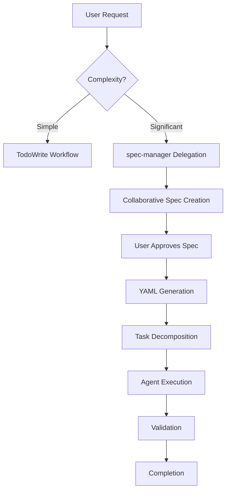

# Spec-Driven Development Workflow

**Status**: Active
**Version**: 1.0
**Last Updated**: 2025-10-23

---

## Table of Contents

- [What is Spec-Driven Development?](#what-is-spec-driven-development)
- [When to Use Spec-Driven Workflow](#when-to-use-spec-driven-workflow)
- [Quick Start](#quick-start)
- [How It Works](#how-it-works)
- [File Structure](#file-structure)
- [Creating a Spec](#creating-a-spec)
- [Spec-Manager Agent](#spec-manager-agent)
- [Working with Specs](#working-with-specs)
- [Examples](#examples)
- [FAQs](#faqs)
- [Best Practices](#best-practices)

---

## What is Spec-Driven Development?

**Spec-driven development** is a collaborative workflow where you and Claude co-author a comprehensive **specification** (spec) before implementation. Instead of reviewing lines of code, you work in "spec terms" - agreeing on goals, design, tasks, and validation criteria upfront.

### Key Principles

1. **User co-authors specifications** - You don't just request features, you actively collaborate on the design
2. **Communicate in spec terms** - Changes discussed as "update spec section 2.3" not "change line 45"
3. **Persistent documentation** - Specs remain as design docs after completion
4. **Clear traceability** - Every requirement links to design, tasks, tests, and code
5. **Flexible approach** - Use for complex work, skip for simple tasks

### Why Use Spec-Driven Development?

**Benefits**:
- ✅ **Alignment on design** before any code is written
- ✅ **Fewer misunderstandings** through collaborative spec creation
- ✅ **Less rework** because design issues caught early
- ✅ **Better documentation** as a natural byproduct
- ✅ **Clearer validation** with explicit acceptance criteria

**Comparison to Traditional Workflow**:

| Aspect | Traditional (TodoWrite) | Spec-Driven |
|--------|------------------------|-------------|
| **Planning** | Quick task list | Comprehensive spec (15 min) |
| **User involvement** | Review code after | Co-author design before |
| **Communication** | Code-level changes | Spec-level changes |
| **Documentation** | Often skipped | Built-in |
| **Best for** | Simple tasks (1-2 files) | Significant features (5+ files) |
| **Time investment** | Quick start | Upfront planning |
| **Rework risk** | Higher | Lower |

---

## When to Use Spec-Driven Workflow

### Use Spec-Driven for:

✅ **Significant features** - New features or subsystems
✅ **Architectural changes** - Design decisions affecting multiple components
✅ **Multi-agent coordination** - Requires 5+ files or 3+ agents
✅ **Complex changes** - Significant refactoring or system modifications
✅ **Security-critical** - Authentication, authorization, data protection
✅ **Data migrations** - Schema changes or data transformations
✅ **User explicitly requests** - "Let's create a spec" or "spec-driven approach"

### Use TodoWrite for:

✅ **Simple bug fixes** - 1-2 files, single agent
✅ **Typos/documentation** - Quick edits
✅ **Single-file changes** - Isolated modifications
✅ **User prefers quick iteration** - Explicit request for fast implementation

### Decision Matrix

```
Is the change significant? (5+ files, 3+ agents, complex design, or security-critical)
  ↓ YES
Recommend Spec-Driven Workflow
  ↓
"This looks like a significant change [because...].
I recommend spec-driven workflow (10-15 min upfront, clearer design).
Sound good?"
  ↓
User confirms → spec-manager creates spec
  ↓ NO
Use TodoWrite (standard workflow)
```

---

## Quick Start

### For Simple Tasks (TodoWrite)

```
User: "Fix typo in README line 5"
Claude: [Uses TodoWrite - no spec needed]
```

### For Significant Features (Spec-Driven)

```
User: "Add OAuth2 authentication to the app"

Claude: "This is a significant feature (auth system, multi-component, security).
I recommend spec-driven workflow (15 min planning upfront).
Sound good?"

User: "Yes"

Claude: [Delegates to spec-manager]
  → spec-manager: "Let's start with Goals & Requirements..."
  → [Collaborative spec creation - Goals, Design, Plan, Tests]
  → [User approves spec]
  → [spec-manager generates YAML, decomposes tasks, executes]
  → [Validation and completion]
```

---

## How It Works

### High-Level Workflow



### Detailed Spec-Driven Process

#### 1. **Complexity Evaluation** (Main LLM)
- Analyzes user request
- Estimates scope (files, agents, complexity)
- Recommends spec-driven vs TodoWrite
- Gets user confirmation

#### 2. **Collaborative Spec Creation** (spec-manager + User)
- **Section 1: Goals & Requirements**
  - Primary goal and why
  - User stories (As a X, I want Y, so that Z)
  - Acceptance criteria (specific, testable)
  - Success metrics
  - **User approves** before continuing

- **Section 2: Technical Design**
  - Architecture overview and decisions
  - Component breakdown with responsibilities
  - Data structures and APIs
  - Dependencies
  - **User approves** before continuing

- **Section 3: Implementation Plan**
  - Task breakdown with agent assignments
  - Dependencies and execution sequence
  - Risk assessment
  - **User approves** before continuing

- **Section 4: Test Strategy**
  - Test cases linked to acceptance criteria
  - Test types (unit, integration, e2e)
  - Validation checklist
  - **User approves** before continuing

- **Save Markdown spec** to `specs/active/YYYY-MM-DD-feature-name.md`

#### 3. **YAML Translation** (spec-manager)
- Auto-generate structured YAML from approved Markdown
- Save to `specs/active/YYYY-MM-DD-feature-name.yaml`
- Agents will consume YAML for task execution

#### 4. **Task Decomposition** (spec-manager)
- Break spec into executable tasks
- Assign agents based on domain + historical performance
- Create execution plan (sequential/parallel)
- **User approves** execution plan

#### 5. **Execution Coordination** (spec-manager + Execution Agents)
- Invoke agents with spec context
- Each agent receives:
  - Full spec file path
  - Their specific task
  - Linked design sections
  - Linked acceptance criteria
- Log execution in spec (Section 5: Execution Log)
- Link telemetry: `spec_id` + `spec_section`

#### 6. **Change Management** (spec-manager)
- Handle implementation discoveries in "spec terms"
- Example: "Spec section 2.3 (Auth Strategy) needs update. Current: JWT. Proposed: OAuth2. Affects: [sections]. Approve?"
- **User approves** changes
- Update Markdown → Regenerate YAML → Continue

#### 7. **Validation & Completion** (spec-manager)
- Verify all acceptance criteria met
- All tests pass
- Update Section 7: Completion Summary
- **User confirms** completion
- Move spec: `specs/active/` → `specs/completed/`

---

## File Structure

```
specs/
├── README.md                    # This file
├── templates/
│   ├── SPEC_TEMPLATE.md        # Markdown spec template
│   └── SPEC_SCHEMA.yaml        # YAML spec schema
├── active/                     # Specs in progress
│   ├── 2025-10-23-feature-name.md
│   └── 2025-10-23-feature-name.yaml
└── completed/                  # Finished specs (design docs)
    ├── 2025-10-20-oauth2-auth.md
    └── 2025-10-20-oauth2-auth.yaml
```

### File Naming Convention

**Format**: `YYYY-MM-DD-feature-name.md`

**Examples**:
- `2025-10-23-oauth2-authentication.md`
- `2025-10-23-user-dashboard-redesign.md`
- `2025-10-23-database-migration-tool.md`

**Spec ID Format**: `spec-YYYYMMDD-feature-name`

**Examples**:
- `spec-20251023-oauth2-authentication`
- `spec-20251023-user-dashboard-redesign`

---

## Creating a Spec

### Manual Creation (Advanced)

If you want to create a spec manually (not using spec-manager):

1. **Copy the template**:
   ```bash
   cp specs/templates/SPEC_TEMPLATE.md specs/active/2025-10-23-my-feature.md
   ```

2. **Fill in each section**:
   - Replace all `[placeholders]` with actual content
   - Ensure linkages are explicit (e.g., "Links to: AC-1, TC-2")
   - Follow the structure exactly

3. **Generate YAML** (when translation tool exists):
   ```bash
   python specs/tools/translate_spec.py \
     --input specs/active/2025-10-23-my-feature.md \
     --output specs/active/2025-10-23-my-feature.yaml \
     --validate
   ```

4. **Use with spec-manager**:
   - spec-manager can import existing specs
   - Continue from any section (partial specs supported)

### Automated Creation (Recommended)

Let spec-manager guide you:

```
User: "I want to add [significant feature]"

Claude: "Significant feature detected. Recommend spec-driven approach.
Let's create a spec - spec-manager will guide you through each section.
Sound good?"

User: "Yes"

[spec-manager takes over and collaboratively creates spec]
```

---

## Spec-Manager Agent

**Location**: `agents/spec-manager.md`

**Role**: Orchestrator of spec-driven development workflow

**Capabilities**:
- Evaluate complexity (spec-driven vs TodoWrite decision)
- Collaborate on spec creation (section by section)
- Translate Markdown to YAML
- Decompose tasks and assign agents
- Coordinate execution with spec context
- Manage changes in spec terms
- Validate completion against acceptance criteria

**When invoked**:
- Main LLM detects significant feature request
- User explicitly asks for spec-driven approach
- Complexity analysis recommends spec workflow

**How it communicates**:
- **Spec terms**: "Spec section 2.3 needs update..."
- **Linkage-focused**: "This affects AC-1 and AC-2..."
- **User-centric**: "Want to review spec or proceed?"
- **NOT code terms**: Never "change line 45" or "modify function X"

---

## Working with Specs

### User Communication Style

**Spec-Driven Communication** (spec-manager):
```
✅ "Spec section 2.3 (Component X) needs update due to [reason].
   Affects sections: [2.3, 3.1.task-2].
   Current: [X].
   Proposed: [Y].
   Approve?"

✅ "Implementation complete. All 5 acceptance criteria met.
   All 12 tests passing.
   Want to review code or mark spec complete?"

✅ "This task links to AC-1 and AC-2 from the spec.
   We're implementing section 2.2.Component-1."
```

**Code-Driven Communication** (AVOID in spec-driven workflow):
```
❌ "Should I change line 45 to use argon2 instead of bcrypt?"
❌ "I modified these 8 files, want to review them all?"
❌ "Function getUserAuth needs to be updated, ok?"
```

### Optional Code Review

Users can always request to see code:

```
User: "Show me the authentication code"
spec-manager: [Shows relevant code implementation]

User: "Just tell me if spec is met"
spec-manager: "All acceptance criteria met. No code review needed."
```

**Default**: Trust spec adherence, skip detailed code review

---

## Examples

### Example 1: Simple Task (TodoWrite)

```
User: "Fix typo in README line 5"

Claude: [Classifies as SIMPLE → Uses TodoWrite]
  1. Creates todo item
  2. Delegates to domain specialist
  3. Fixes typo
  4. git-workflow-manager commits

Time: ~2 minutes
```

### Example 2: Significant Feature (Spec-Driven)

```
User: "Add user authentication with OAuth2 and JWT tokens"

Claude: [Classifies as SIGNIFICANT → Recommends spec-driven]
"This is a significant feature (auth system, security-critical, multi-component).
I recommend spec-driven workflow (15 min upfront planning). Sound good?"

User: "Yes"

Claude: [Delegates to spec-manager]

spec-manager: "Let's create a spec for OAuth2 authentication.
Starting with Goals & Requirements..."

[15 minutes of collaborative spec creation]
  - Section 1: Goals (OAuth2 login, secure tokens, session management)
  - Section 2: Design (JWT strategy, endpoints, security considerations)
  - Section 3: Plan (5 tasks, 3 agents, 8 hours estimated)
  - Section 4: Tests (15 test cases, integration tests, security audit)

User: [Approves each section]

spec-manager: "Spec approved. Generating YAML..."
spec-manager: "YAML generated. Task breakdown:
  - Task 1: backend-architect (OAuth2 endpoints) - 4 hours
  - Task 2: security-auditor (security review) - 1 hour
  - Task 3: frontend-developer (login UI) - 2 hours
  - Task 4: unit-test-expert (test suite) - 1 hour

Ready to execute?"

User: "Go ahead"

[Implementation executes - 8 hours]

spec-manager: "Implementation complete.
  ✅ All 5 acceptance criteria met
  ✅ All 15 test cases passing
  ✅ Security audit complete

Spec marked as completed and moved to specs/completed/."

Total time: 15 min planning + 8 hours implementation = aligned execution
```

### Example 3: Spec Change During Implementation

```
[During OAuth2 implementation]

backend-architect: "Spec section 2.5 (Dependencies) lists jsonwebtoken library,
but it doesn't support ES256 algorithm needed for AC-3 (secure tokens).
Recommend jose library instead?"

spec-manager: "Spec section 2.5 (Dependencies) needs update:
  - Current: jsonwebtoken
  - Proposed: jose (supports ES256, required for AC-3)
  - Affected sections: 2.5, 3.1.task-1
  - Still meets: AC-3 (secure token generation)

Approve change?"

User: "Approved"

spec-manager: [Updates Markdown spec sections 2.5 and 3.1.task-1]
spec-manager: [Regenerates YAML]
spec-manager: [Logs change in Section 6]
spec-manager: "Spec updated. Continuing with jose library."

[Implementation continues with approved change]
```

---

## FAQs

### Q: When should I use spec-driven vs TodoWrite?

**A**: Use spec-driven for significant features (5+ files, 3+ agents, security-critical, or architectural changes). Use TodoWrite for simple tasks (bug fixes, typos, single-file edits). When in doubt, Claude will recommend the appropriate workflow.

### Q: How long does spec creation take?

**A**: Typically 10-20 minutes for a well-scoped feature. Complex features may take 30-40 minutes. This upfront investment prevents hours of rework.

### Q: Can I modify a spec during implementation?

**A**: Yes! spec-manager handles changes in "spec terms". Propose updates to affected sections, get user approval, and the spec is updated. All changes are logged.

### Q: Do I need to review all the code?

**A**: No. The spec defines acceptance criteria and validation. If spec-manager reports "all criteria met, all tests passing", you can trust the implementation. Code review is optional.

### Q: What if I want to see the code anyway?

**A**: Just ask! "Show me the authentication code" or "Let me review the database schema". spec-manager will provide details on request.

### Q: Can I use spec-driven for small features?

**A**: You can, but it's usually overkill. TodoWrite is more efficient for simple tasks. Spec-driven shines for complex, multi-component work.

### Q: What happens to completed specs?

**A**: They move to `specs/completed/` and serve as design documentation. They're valuable references for understanding system architecture and decisions.

### Q: Can I start a spec and finish it later?

**A**: Yes. Save partial specs to `specs/active/` with status "draft". Resume anytime by asking spec-manager to continue.

### Q: How do specs integrate with telemetry?

**A**: Every agent invocation links to the spec via `spec_id` and `spec_section` fields. This enables analysis of which spec sections cause issues and tracks spec adherence quality.

### Q: Can I create a spec template for recurring patterns?

**A**: Yes! Create custom templates in `specs/templates/`. Example: `api-endpoint-spec.md` for new API features. spec-manager can use custom templates.

---

## Best Practices

### 1. **Start with Clear Goals**
- Spend extra time on Section 1 (Goals & Requirements)
- Ensure acceptance criteria are specific and testable
- Define success metrics upfront

### 2. **Explicit Linkages**
- Always link tasks to acceptance criteria
- Link test cases to requirements
- Link design components to goals
- Use format: "Links to: AC-1, TC-2, Section 2.3"

### 3. **Approval Checkpoints**
- Approve each section before moving forward
- Don't rush through spec creation
- Ask questions if anything is unclear

### 4. **Communicate in Spec Terms**
- Think "update spec section X" not "change code line Y"
- Focus on design decisions, not implementation details
- Use spec as shared language with Claude

### 5. **Embrace Spec Changes**
- Implementation often reveals better approaches
- Updating the spec is normal and encouraged
- Log all changes for future reference

### 6. **Trust the Process**
- If spec says "all criteria met", trust it
- Code review is optional, not mandatory
- Spec adherence is the primary quality gate

### 7. **Use Specs as Documentation**
- Completed specs = design docs
- Reference past specs for architecture decisions
- Share specs with team for alignment

### 8. **Measure and Improve**
- Track how often specs need changes (<20% is good)
- Note which sections are most stable/volatile
- Improve future specs based on learnings

---

## Resources

- **Spec Template**: `specs/templates/SPEC_TEMPLATE.md`
- **YAML Schema**: `specs/templates/SPEC_SCHEMA.yaml`
- **spec-manager Agent**: `agents/spec-manager.md`
- **CLAUDE.md Rules**: `CLAUDE.md` (spec-driven-development rule)
- **Example Spec**: `specs/active/2025-10-23-spec-to-yaml-translator.md`

---

## Support

**Questions?** Ask Claude:
- "How does spec-driven development work?"
- "When should I use a spec?"
- "Can you show me an example spec?"

**Issues?** Check:
- `CLAUDE.md` for workflow rules
- Example specs in `specs/active/` and `specs/completed/`
- spec-manager agent documentation

---

**Last Updated**: 2025-10-23
**Version**: 1.0
**Maintained by**: Claude OaK Agents Team
