# Claude Code Agent System Architecture

## System Overview

This diagram shows the enhanced 21-agent system with mandatory delegation enforcement, trigger-based routing, and intelligent specialist selection. The system prevents main LLM bypass through multiple enforcement layers.

```mermaid
graph TD
    User[User Request] --> MainLLM[Main LLM Coordinator]

    MainLLM --> EnforcementCheck{🚨 Delegation<br/>Enforcement Check}

    %% Delegation Enforcement
    EnforcementCheck -->|Action Verbs<br/>File Operations<br/>Programming Keywords| TriggerRouting[Trigger-Based<br/>Routing System]
    EnforcementCheck -->|Simple Tasks| DirectResponse[Direct Response]

    %% Specialist Routing
    TriggerRouting --> ProjectContext{Project Context<br/>Analysis}

    ProjectContext -->|Frontend/UI| FrontendDev[frontend-developer<br/>React/Vue/Angular]
    ProjectContext -->|Backend/API| BackendArch[backend-architect<br/>Database/Microservices]
    ProjectContext -->|ML/Data| MLEngineer[ml-engineer<br/>Python/TensorFlow/MLOps]
    ProjectContext -->|Blockchain| BlockchainDev[blockchain-developer<br/>Solidity/Web3/DeFi]
    ProjectContext -->|Mobile| MobileDev[mobile-developer<br/>React Native/iOS/Android]
    ProjectContext -->|Legacy Systems| LegacyMaint[legacy-maintainer<br/>Java/C#/Enterprise]
    ProjectContext -->|Core Programming| Programmer[programmer<br/>Go>TypeScript>Bash>Ruby]
    ProjectContext -->|Infrastructure| InfraSpec[infrastructure-specialist<br/>CDK/Cloud Architecture]
    ProjectContext -->|Security| SecAudit[security-auditor<br/>Penetration Testing/Compliance]
    ProjectContext -->|Testing| QASpec[qa-specialist<br/>End-to-End/Integration]

    %% Quality Gates (Automatic) - All specialist agents feed into quality gates
    FrontendDev --> QualityGate1[🚨 MANDATORY<br/>code-reviewer]
    BackendArch --> QualityGate1
    MLEngineer --> QualityGate1
    BlockchainDev --> QualityGate1
    MobileDev --> QualityGate1
    LegacyMaint --> QualityGate1
    Programmer --> QualityGate1
    InfraSpec --> QualityGate1

    QualityGate1 -->|PASS| QualityGate2[🚨 MANDATORY<br/>code-clarity-manager]
    QualityGate1 -->|FAIL| Programmer

    %% Code Clarity Manager coordinates dual analysis
    QualityGate2 --> TopDown
    QualityGate2 --> BottomUp
    TopDown --> ClarityDecision{Clarity<br/>Assessment}
    BottomUp --> ClarityDecision

    ClarityDecision -->|PASS| UnitTest[unit-test-expert]
    ClarityDecision -->|FAIL| Programmer

    %% Final stages
    UnitTest --> GitOps[git-workflow-manager]
    GitOps --> Changelog[changelog-recorder]

    %% Specialized Support Agents (parallel when needed)
    MainLLM --> DebugSpec[debug-specialist<br/>🚨 HIGHEST PRIORITY]
    MainLLM --> ProjectMgr[project-manager<br/>Complex Projects]
    MainLLM --> DataSci[data-scientist<br/>Data Analysis]
    MainLLM --> BusinessAnalyst[business-analyst<br/>Requirements/User Stories]
    MainLLM --> ContentWriter[content-writer<br/>Technical Documentation]
    MainLLM --> AgentCreator[agent-creator<br/>Meta-operations]

    %% Error Flows
    DebugSpec -->|Blocks All| QualityGate1
    DebugSpec -->|Until Fixed| QualityGate2

    %% Feedback Loops and Systems Architecture Integration
    SysArch[systems-architect<br/>System Design/Planning]
    GitOps -.->|System State| SysArch
    Changelog -.->|Change History| SysArch
    SecAudit -.->|Security Analysis| SysArch
    QASpec -.->|Testing Insights| SysArch

    %% Rule Inheritance
    GlobalRules[Global Rules<br/>/Users/jamsa/.claude/CLAUDE.md] --> MainLLM
    LocalRules[Local Rules<br/>./CLAUDE.md] -->|Overrides| MainLLM

    GlobalAgents[Global Agents<br/>/Users/jamsa/.claude/agents/] --> AgentRes{Agent<br/>Resolution}
    LocalAgents[Local Agents<br/>./claude/agents/] -->|Overrides| AgentRes
    AgentRes --> MainLLM

    %% Styling
    classDef mandatory fill:#ff6b6b,stroke:#000,stroke-width:3px,color:#fff
    classDef enforcement fill:#ff9999,stroke:#000,stroke-width:3px,color:#000
    classDef specialist fill:#74c0fc,stroke:#000,stroke-width:2px
    classDef support fill:#69db7c,stroke:#000,stroke-width:2px
    classDef coordinator fill:#ffd43b,stroke:#000,stroke-width:3px
    classDef quality fill:#da77f2,stroke:#000,stroke-width:2px

    class QualityGate1,QualityGate2,DebugSpec mandatory
    class EnforcementCheck,TriggerRouting enforcement
    class FrontendDev,BackendArch,MLEngineer,BlockchainDev,MobileDev,LegacyMaint,Programmer,InfraSpec specialist
    class BusinessAnalyst,ContentWriter,DataSci,ProjectMgr,SysArch support
    class MainLLM coordinator
    class TopDown,BottomUp,UnitTest,GitOps,Changelog,QASpec quality
```

## Key System Characteristics

### 🚨 Delegation Enforcement System
- **Mandatory delegation**: Main LLM prohibited from programming/technical work
- **Trigger-based routing**: Action verbs automatically invoke specialist agents
- **Bypass prevention**: 5-layer enforcement prevents main LLM technical bypass
- **Project context routing**: Intelligent specialist selection based on technology stack

### 🏗️ Specialized Agent Categories (21 Total)
- **Core Development**: frontend-developer, backend-architect, programmer, qa-specialist, business-analyst, content-writer
- **Programming Specialists**: ml-engineer, blockchain-developer, mobile-developer, legacy-maintainer
- **Security & Quality**: security-auditor, code-reviewer, code-clarity-manager, top-down-analyzer, bottom-up-analyzer, unit-test-expert
- **Infrastructure & Operations**: infrastructure-specialist, systems-architect, performance-optimizer, dependency-scanner, debug-specialist
- **Workflow & Management**: git-workflow-manager, changelog-recorder, project-manager, data-scientist

### 🚨 Mandatory Quality Gates
- **code-reviewer**: Blocks commits until security/quality standards met
- **code-clarity-manager**: Ensures maintainability via dual analysis (top-down + bottom-up)
- **debug-specialist**: Highest priority, blocks all other work until resolved

### 📋 Agent Coordination Patterns
- **Sequential**: Specialist Implementation → Code Review → Clarity → Testing → Git
- **Parallel**: Multiple specialists work simultaneously on independent components
- **Blocking**: Quality gates prevent progression until all issues resolved
- **Override**: Debug specialist interrupts all workflows with highest priority

### 🎯 Optimization Prevention
All agents include checks for:
- Premature optimization (Knuth's principle)
- Over-engineering without proven need
- YAGNI violations (You Aren't Gonna Need It)
- One-way door decisions without justification

## Agent Dependencies

This enhanced system ensures quality through mandatory gates, prevents main LLM bypass through delegation enforcement, and provides comprehensive specialist coverage across all development domains while incorporating feedback from analysis agents into architectural planning decisions.