# Claude Code Agent System Architecture

## System Overview

This diagram shows the complete agent orchestration system, including input flow from analysis agents to the systems-architect during planning phases.

```mermaid
graph TD
    User[User Request] --> MainLLM[Main LLM Orchestrator]

    MainLLM --> DetectPhase{Planning vs<br/>Implementation Phase?}

    %% Planning Phase
    DetectPhase -->|Planning Phase| PlanningFlow[Planning Workflow]
    PlanningFlow --> SysArch[systems-architect]

    %% Analysis Agents Feed into Systems Architect
    CodeRev[code-reviewer<br/>Quality Analysis] --> SysArch
    TopDown[top-down-analyzer<br/>Architecture Analysis] --> SysArch
    BottomUp[bottom-up-analyzer<br/>Implementation Analysis] --> SysArch
    SecAudit[security-auditor<br/>Security Analysis] --> SysArch
    PerfOpt[performance-optimizer<br/>Performance Analysis] --> SysArch

    SysArch --> ArchBlueprint[Architecture Blueprint<br/>- One-way doors<br/>- Technical debt<br/>- Constraints]

    %% Implementation Phase
    DetectPhase -->|Implementation| ImplFlow[Implementation Workflow]
    ArchBlueprint --> ImplFlow

    ImplFlow --> TaskType{Task Type?}

    TaskType -->|Code Changes| Programmer[programmer]
    TaskType -->|Infrastructure| InfraSpec[infrastructure-specialist]
    TaskType -->|Security Work| SecAudit
    TaskType -->|Performance| PerfOpt

    %% Quality Gates (Automatic)
    Programmer --> QualityGate1[🚨 MANDATORY<br/>code-reviewer]
    InfraSpec --> QualityGate1

    QualityGate1 -->|PASS| QualityGate2[🚨 MANDATORY<br/>code-clarity-manager]
    QualityGate1 -->|FAIL| Programmer

    %% Code Clarity Manager coordinates dual analysis
    QualityGate2 --> TopDown
    QualityGate2 --> BottomUp
    TopDown --> ClarityDecision{Clarity<br/>Assessment}
    BottomUp --> ClarityDecision

    ClarityDecision -->|PASS| UnitTest[unit-test-expert]
    ClarityDecision -->|FAIL| Programmer

    %% Final stages
    UnitTest --> GitOps[git-workflow-manager]
    GitOps --> Changelog[changelog-recorder]

    %% Specialized Agents (parallel when needed)
    MainLLM --> DebugSpec[debug-specialist<br/>🚨 HIGHEST PRIORITY]
    MainLLM --> ProjectMgr[project-manager<br/>Complex Projects]
    MainLLM --> DataSci[data-scientist<br/>Data Analysis]
    MainLLM --> AgentCreator[agent-creator<br/>Meta-operations]

    %% Error Flows
    DebugSpec -->|Blocks All| QualityGate1
    DebugSpec -->|Until Fixed| QualityGate2

    %% Feedback Loops
    GitOps -.->|System State| SysArch
    Changelog -.->|Change History| SysArch

    %% Rule Inheritance
    GlobalRules[Global Rules<br/>/Users/jamsa/.claude/CLAUDE.md] --> MainLLM
    LocalRules[Local Rules<br/>./CLAUDE.md] -->|Overrides| MainLLM

    GlobalAgents[Global Agents<br/>/Users/jamsa/.claude/agents/] --> AgentRes{Agent<br/>Resolution}
    LocalAgents[Local Agents<br/>./claude/agents/] -->|Overrides| AgentRes
    AgentRes --> MainLLM

    %% Styling
    classDef mandatory fill:#ff6b6b,stroke:#000,stroke-width:3px,color:#fff
    classDef analysis fill:#74c0fc,stroke:#000,stroke-width:2px
    classDef architect fill:#69db7c,stroke:#000,stroke-width:3px
    classDef orchestrator fill:#ffd43b,stroke:#000,stroke-width:3px
    classDef specialist fill:#da77f2,stroke:#000,stroke-width:2px

    class QualityGate1,QualityGate2,DebugSpec mandatory
    class CodeRev,TopDown,BottomUp,SecAudit,PerfOpt analysis
    class SysArch architect
    class MainLLM orchestrator
    class Programmer,InfraSpec,UnitTest,GitOps,Changelog specialist
```

## Key System Characteristics

### 🚨 Mandatory Quality Gates
- **code-reviewer**: Blocks commits until quality standards met
- **code-clarity-manager**: Ensures code maintainability via dual analysis
- **debug-specialist**: Highest priority, blocks all other work until resolved

### 🏗️ Planning Phase Integration
- **systems-architect** receives input from all analysis agents
- Maps **one-way door decisions** and technical constraints
- Creates informed architecture blueprints considering existing system state

### 🔄 Agent Feedback Loops
- Analysis agents inform architectural decisions
- System state updates flow back to architect
- Continuous improvement through feedback integration

### 📋 Agent Coordination Patterns
- **Sequential**: Programmer → Code Review → Clarity → Git
- **Parallel**: Multiple analysis agents feed architect
- **Blocking**: Quality gates prevent progression until resolved
- **Override**: Debug specialist interrupts all workflows

### 🎯 Optimization Prevention
All agents include checks for:
- Premature optimization (Knuth's principle)
- Over-engineering without proven need
- YAGNI violations (You Aren't Gonna Need It)
- One-way door decisions without justification

## Agent Dependencies

This system ensures quality through mandatory gates while incorporating feedback from analysis agents into architectural planning decisions.